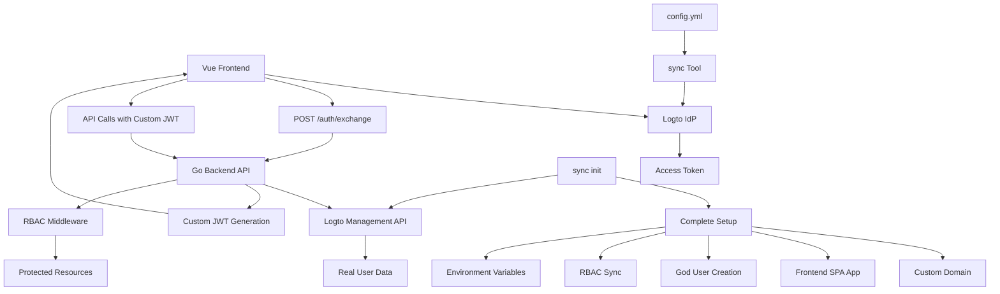
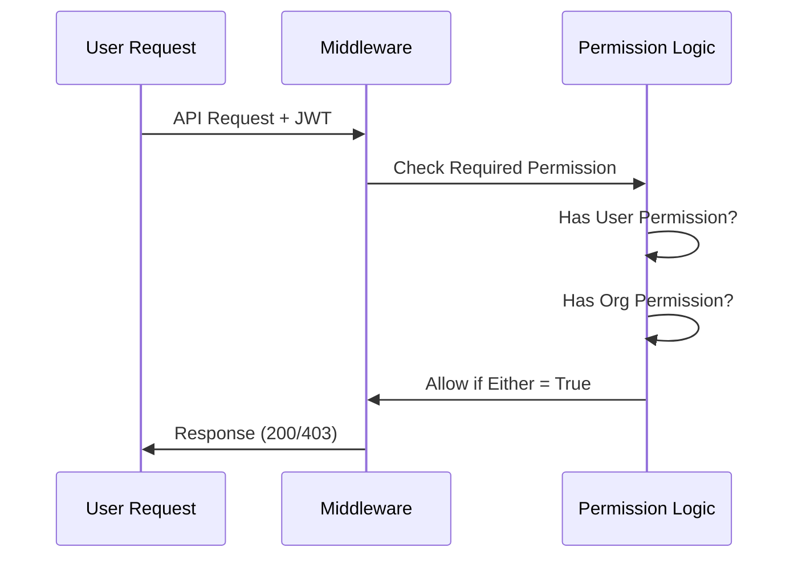
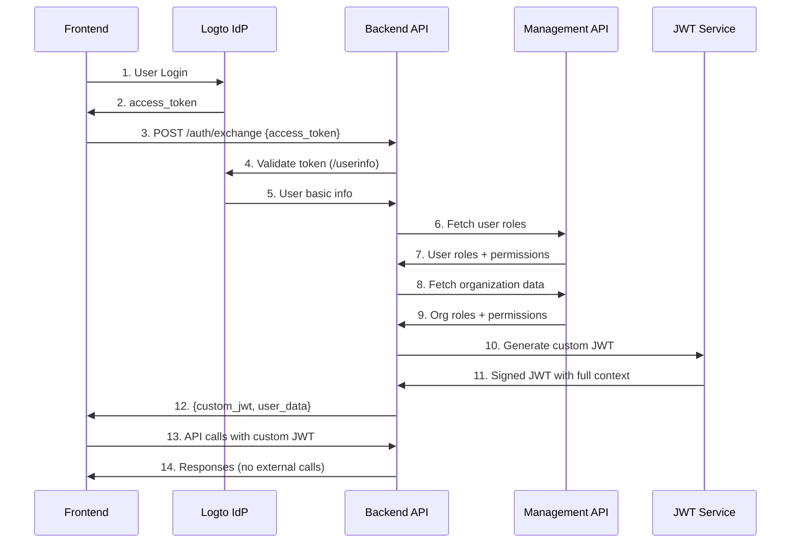
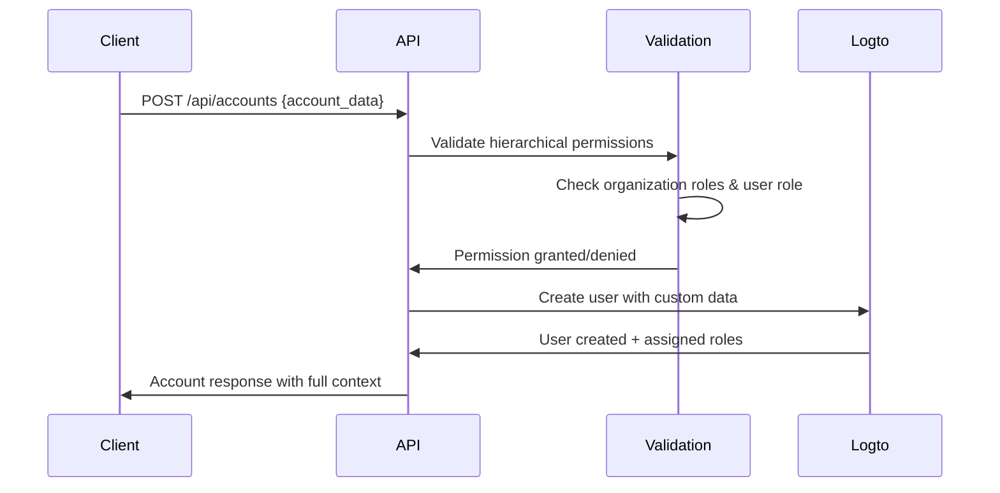

# 🔐 Nethesis Simplified RBAC System
*Clean Role-Based Access Control with Business Logic Separation*

---

## 📋 **System Overview**

### **Architectural Components**


### **🎯 Objectives**
- **Clear separation** between business hierarchy and technical capabilities
- **Real-time data integration** via Logto Management API
- **Performance optimization** through token exchange and JWT embedding
- **Simplified permission model** with direct role-to-permission mapping
- **Intuitive authorization** combining organization and user roles
- **Scalable architecture** for ecosystem growth
- **Zero-to-production deployment** via comprehensive init command
- **Security-first logging** with automatic sensitive data redaction
- **Code quality** with comprehensive refactoring and lint compliance

---

## 🏢 **Business Hierarchy (Organization Roles)**

### **Commercial Chain Structure**
```
                    🔱 GOD (Nethesis)
                          |
                    🌍 DISTRIBUTORS
                       /        \
                 📈 RESELLERS    📈 RESELLERS
                    /    \         /    \
              👥 CUSTOMERS    👥 CUSTOMERS
```

### **Organization Roles & Business Logic**
| Role | Can Create | Can Manage | Inherited From |
|------|------------|------------|----------------|
| **God** | Distributors, Resellers, Customers | Everything | Direct assignment |
| **Distributor** | Resellers, Customers | Sub-levels | Organization membership |
| **Reseller** | Customers | Own clients | Organization membership |
| **Customer** | - | Own data | Organization membership |

**Key Principle**: Users **inherit** their organization's business role and permissions automatically.

---

## 👥 **Technical Capabilities (User Roles)**

### **Role Categories**

#### **🔧 Technical Operations**
- **Admin**: Complete platform administration, dangerous operations
- **Support**: System management, customer troubleshooting, standard operations


### **Permission Matrix**

#### **Technical Systems (MVP)**
| Role | Systems Read | Systems Manage | Systems Admin | Systems Destroy |
|------|:------------:|:--------------:|:-------------:|:---------------:|
| **Admin** | ✅ | ✅ | ✅ | ✅ |
| **Support** | ✅ | ✅ | ❌ | ❌ |

---

## 🎯 **Simplified Architecture**

### **Permission Logic**
```
Final User Permissions = Organization Role Permissions + User Role Permissions
```

### **Real-World Examples**

#### **Example 1: Marco (ACME Reseller + Admin)**
```yaml
Organization: "ACME" (type: Reseller)
Organization Role: "Reseller"
User Roles: ["Admin"]

Resulting Permissions:
  # From Organization Role (Business Logic)
  - create:customers
  - manage:customers
  - read:own-customers

  # From User Role (Technical Capabilities)
  - admin:systems
  - destroy:systems
  - manage:systems
  - read:systems
```

### **Data Visibility & Isolation**

The system implements hierarchical data visibility based on organization roles and creation relationships:

#### **Visibility Rules**
- **God**: Can see all distributors, resellers, and customers regardless of who created them
- **Distributors**: Can see only:
  - Resellers they created (`customData.createdBy = distributor.organizationId`)
  - Customers created by their resellers (transitively)
- **Resellers**: Can see only:
  - Customers they created (`customData.createdBy = reseller.organizationId`)
- **Customers**: Cannot access organization management endpoints

#### **CustomData Structure**
When organizations are created, they include visibility metadata:
```json
{
  "customData": {
    "createdBy": "creating-organization-id",
    "createdByRole": "Distributor"
  }
}
```

#### **Visibility Examples**
```yaml
# Distributor "Nethesis" creates Reseller "ACME"
ACME Reseller:
  customData:
    createdBy: "nethesis-org-id"
    createdByRole: "Distributor"

# Reseller "ACME" creates Customer "TechCorp"
TechCorp Customer:
  customData:
    createdBy: "acme-org-id"
    createdByRole: "Reseller"

# Visibility Results:
# God: Sees Nethesis, ACME, TechCorp
# Nethesis Distributor: Sees ACME (created by them), TechCorp (created by their reseller)
# ACME Reseller: Sees only TechCorp (created by them)
# TechCorp Customer: Cannot access organization endpoints
```

#### **Example 2: Edoardo (Nethesis Distributor + Support)**
```yaml
Organization: "Nethesis" (type: Distributor)
Organization Role: "Distributor"
User Roles: ["Support"]

Resulting Permissions:
  # From Organization Role (Business Logic)
  - create:resellers
  - manage:resellers
  - create:customers
  - manage:customers

  # From User Role (Technical Capabilities)
  - manage:systems
  - read:systems
```

---

## 🔧 **Implementation**

### **User Model Structure**
```go
type User struct {
    ID               string   `json:"id"`
    Username         string   `json:"username"`
    Email            string   `json:"email"`

    // Technical capabilities (what the user can DO)
    UserRoles        []string `json:"user_roles"`        // ["Admin", "Support"]
    UserPermissions  []string `json:"user_permissions"`  // Derived from roles

    // Business hierarchy (what the organization allows)
    OrgRole          string   `json:"org_role"`          // "Distributor"
    OrgPermissions   []string `json:"org_permissions"`   // Derived from org role
    OrganizationID   string   `json:"organization_id"`   // "nethesis-001"
    OrganizationName string   `json:"organization_name"` // "Nethesis S.r.l."
}
```

### **Middleware Usage**
```go
// ✅ Technical capability groups - role-based
systemsGroup := protected.Group("/systems",
    middleware.RequireUserRole("Support"))

// ✅ Business hierarchy groups - organization role-based
distributorsGroup := protected.Group("/distributors",
    middleware.RequireOrgRole("God")) // Only God can manage distributors

resellersGroup := protected.Group("/resellers",
    middleware.RequireAnyOrgRole("God", "Distributor")) // God + Distributors manage resellers

customersGroup := protected.Group("/customers",
    middleware.RequireAnyOrgRole("God", "Distributor", "Reseller")) // All levels manage customers

// ✅ Specific operations - explicit permissions
systemsGroup.POST("/:id/restart",
    middleware.RequirePermission("manage:systems"), methods.RestartSystem)

// ✅ Admin-only operations - explicit admin permissions
systemsGroup.DELETE("/:id",
    middleware.RequirePermission("admin:systems"), methods.DeleteSystem)
```

### **Permission Flow**


---

## 📊 **Practical Scenarios**

### **Scenario 1: System Management**
```bash
# ✅ Support can manage systems (User Role permission)
curl -X POST /api/systems/123/restart \
  -H "Authorization: Bearer <support-token>"
# → 200 OK (has manage:systems from Support role)

# ✅ Distributor can create resellers (Organization Role permission)
curl -X POST /api/resellers \
  -H "Authorization: Bearer <distributor-token>"
# → 200 OK (has create:resellers from Distributor org role)

# ❌ Customer cannot create distributors (lacks both permissions)
curl -X POST /api/distributors \
  -H "Authorization: Bearer <customer-token>"
# → 403 Forbidden (no create:distributors permission)
```

### **Scenario 2: Combined Permissions**
```bash
# ✅ Reseller + Admin can manage customer systems
curl -X POST /api/customers/123/systems/restart \
  -H "Authorization: Bearer <reseller-admin-token>"
# → 200 OK (create:customers from org + admin:systems from user role)

# ❌ Customer + Support cannot destroy systems
curl -X DELETE /api/systems/123/destroy \
  -H "Authorization: Bearer <customer-support-token>"
# → 403 Forbidden (has read:systems but NOT destroy:systems)
```

---

## ⚙️ **Configuration**

### **config.yml Structure**
```yaml
metadata:
  name: "nethesis-simplified-rbac"
  version: "2.0.0"

hierarchy:
  # BUSINESS HIERARCHY (Organization Types)
  organization_roles:
    - id: god
      permissions:
        - create:distributors
        - manage:distributors
        - create:resellers
        - manage:resellers
        - create:customers
        - manage:customers

    - id: distributor
      permissions:
        - create:resellers
        - manage:resellers
        - create:customers
        - manage:customers

    - id: reseller
      permissions:
        - create:customers
        - manage:customers

    - id: customer
      permissions:
        - read:own-data

  # TECHNICAL CAPABILITIES (User Skills)
  user_roles:
    - id: admin
      permissions:
        - admin:systems
        - manage:systems
        - destroy:systems
        - read:systems

    - id: support
      permissions:
        - manage:systems
        - read:systems

```

### **Complete Setup from Zero (sync init)**

The sync tool now provides complete zero-to-production deployment via the `init` command:

```bash
# Complete Logto initialization from scratch
sync init \
  --tenant-id y4uj0v \
  --backend-client-id 11h51dxo64if0lsct1wos \
  --backend-client-secret your-secret-here \
  --domain dev.my.nethesis.it

# Alternative: Environment variables mode
export TENANT_ID=y4uj0v
export BACKEND_CLIENT_ID=11h51dxo64if0lsct1wos
export BACKEND_CLIENT_SECRET=your-secret-here
export TENANT_DOMAIN=dev.my.nethesis.it
sync init

# JSON/YAML output for automation
sync init --output json
sync init --output yaml
```

#### **Init Command Operations**

The init command performs a comprehensive setup sequence:

1. **Custom Domain Creation**: Creates and verifies custom domain in Logto
2. **Application Management**:
   - Verifies backend M2M application exists with correct permissions
   - Creates frontend SPA application with correct redirect URIs:
     - Development: `http://localhost:5173/callback`
     - Production: `https://domain/callback`
3. **God User Creation**: Creates god@nethesis.it user with secure password generation
4. **Complete RBAC Synchronization**:
   - Organization scopes (create:distributors, manage:resellers, etc.)
   - Organization roles (God, Distributor, Reseller, Customer)
   - User roles (Admin, Support) with permissions
   - JIT (Just-in-Time) provisioning configuration
5. **Role Assignment**: Assigns Admin user role + God organization role to god user
6. **Environment Variable Generation**: Auto-generates all required configuration

#### **Auto-Generated Environment Variables**

```bash
# Backend Configuration
LOGTO_ISSUER=https://y4uj0v.logto.app
LOGTO_AUDIENCE=https://dev.my.nethesis.it/api
LOGTO_JWKS_ENDPOINT=https://y4uj0v.logto.app/oidc/jwks
JWT_SECRET=generated-32-char-secret
LOGTO_MANAGEMENT_CLIENT_ID=11h51dxo64if0lsct1wos
LOGTO_MANAGEMENT_CLIENT_SECRET=your-secret-here
LOGTO_MANAGEMENT_BASE_URL=https://y4uj0v.logto.app

# Frontend Configuration
FRONTEND_LOGTO_ENDPOINT=https://y4uj0v.logto.app
FRONTEND_LOGTO_APP_ID=generated-spa-app-id
API_BASE_URL=https://dev.my.nethesis.it/api
```

#### **Init Command Features**

- **Idempotent Operations**: Safely detects existing resources and prevents duplication
- **Force Mode**: `--force` flag allows complete re-initialization
- **Unified Configuration**: Prevents mixing CLI flags with environment variables
- **Error Handling**: Graceful handling of existing domains, users, and applications
- **Structured Output**: JSON/YAML formats with organized environment variables for CI/CD integration and automation
- **Security**: Secure password generation for god user with entropy validation

### **RBAC Configuration Synchronization**
```bash
# Deploy new configuration
sync sync -c config.yml

# Preview changes
sync sync -c config.yml --dry-run --verbose

# Output:
✅ Creating organization role: Distributor
✅ Creating user role: Admin
✅ Assigning permission: admin:systems to Admin
✅ Creating user role: Support
✅ Sync completed successfully!
```

---

## 🔄 **Token Exchange System**

### **Architecture Overview**

The system implements a sophisticated **token exchange pattern** that combines Logto authentication with real-time Management API data fetching for optimal performance and security.

### **Authentication Flow**



### **Management API Integration**

#### **Data Fetching Process**
1. **User Roles (Technical Capabilities)**
   - `GET /users/{id}/roles` → Fetch assigned user roles
   - `GET /roles/{id}/scopes` → Fetch permissions for each role
   - Result: `["Admin"]` → `["admin:systems", "destroy:systems", "manage:systems", "read:systems"]`

2. **Organization Data (Business Hierarchy)**
   - `GET /users/{id}/organizations` → Fetch user's organizations
   - `GET /organizations/{orgId}/users/{userId}/roles` → Fetch org roles
   - `GET /organization-roles/{roleId}/scopes` → Fetch org permissions
   - Result: `"Distributor"` → `["create:resellers", "manage:resellers", "create:customers", "manage:customers"]`

#### **Real Data in JWT**
```json
{
  "user": {
    "id": "real-user-id",
    "username": "marco.rossi",
    "email": "marco@acme.com",
    "user_roles": ["Admin"],
    "user_permissions": ["admin:systems", "destroy:systems", "manage:systems", "read:systems"],
    "org_role": "Distributor",
    "org_permissions": ["create:resellers", "manage:resellers", "create:customers", "manage:customers"],
    "organization_id": "acme-distributor-123",
    "organization_name": "ACME Distribution"
  }
}
```

### **Enhanced Token Exchange Features**

#### **Refresh Token System**
- **Refresh Tokens**: 7-day expiration with automatic renewal
- **Token Rotation**: Each refresh generates new access and refresh tokens
- **Real-time Data**: User data refreshed from Logto during token refresh
- **Graceful Expiry**: Frontend can seamlessly handle token renewal

#### **JWT Security Enhancements**
- **Algorithm Validation**: RS256 for Logto tokens, HS256 for custom JWT
- **Claim Validation**: Enhanced with `nbf` (not before) validation
- **JWKS Caching**: Thread-safe cache with 5-minute TTL and automatic refresh
- **Token Embedding**: All permissions pre-computed and embedded for offline operation

#### **Management API Optimizations**
- **Connection Pooling**: Efficient HTTP client with connection reuse
- **Error Handling**: Comprehensive retry logic and fallback mechanisms
- **Rate Limiting**: Respectful API usage with proper timeout handling
- **Caching Strategy**: User roles and permissions cached in JWT to reduce API calls

## ❓ **Q&A**

**Q: How does a user get Organization Role permissions?**
A: Automatically fetched from Logto Management API based on their organization membership and role assignment in that organization.

**Q: Can a user have multiple User Roles?**
A: Yes! A user can be both "Support" and "Admin", getting permissions from both roles. The system fetches all assigned roles and combines their permissions.

**Q: When are permissions updated?**
A: Permissions are fetched fresh from Logto during token exchange and embedded in the JWT. They update when the JWT expires (24h default) and user does a new token exchange.

**Q: What if Management API is unavailable?**
A: The system gracefully handles failures - token exchange will still work with basic user info, but may have limited permissions until Management API is available again.

**Q: How are permissions synchronized between sync and the backend?**
A: `sync` manages the RBAC structure in Logto, while the backend fetches the current state via Management API. This ensures permissions are always current and reflect any changes made in Logto admin console.

**Q: What if I need very specific permission combinations?**
A: Use `RequirePermission("specific:permission")` - it checks both User and Organization permissions that were fetched from Logto.

**Q: How do I deploy from scratch?**
A: Use `sync init` command for complete zero-to-production setup. It creates domains, applications, users, RBAC, and generates all environment variables automatically.

**Q: What about token refresh and expiration?**
A: Access tokens expire after 24 hours, refresh tokens after 7 days. The `/auth/refresh` endpoint provides seamless token renewal with fresh user data from Logto.

**Q: Is the system secure for production?**
A: Yes. Features comprehensive security including automatic sensitive data redaction in logs, thread-safe JWKS caching, JWT validation with all claims, and structured audit trails.

**Q: How do I handle frontend application management?**
A: The init command automatically creates frontend SPA applications with correct redirect URIs for both development (`localhost:5173`) and production (`https://domain`) environments.

---

## 🔧 **Code Quality & Architecture**

### **Recent Refactoring Improvements (2025-06-28)**

Both sync and backend projects underwent comprehensive refactoring to improve maintainability and code quality:

#### **sync Tool Refactoring**
- **Unified HTTP Response Handling**: Created `handleCreationResponse()` and `handleSimpleResponse()` helper functions eliminating ~150 lines of duplicate code
- **Entity Lookup Helpers**: Extracted `findEntityByField()` pattern reducing code duplication in client operations
- **Constants Consolidation**: Created `internal/constants/constants.go` with all magic strings, endpoints, and configuration values
- **Simple Creation Methods**: Unified `CreateEntitySimple()` pattern for organization roles, user roles, and scopes
- **Error Handling Standardization**: Consistent HTTP response handling with proper defer cleanup and status code validation

#### **Backend Code Quality**
- **golangci-lint Compliance**: Resolved all 16 linting issues (10 errcheck + 6 staticcheck)
- **Error Handling**: Proper `defer func() { _ = resp.Body.Close() }()` patterns for all HTTP responses
- **JWKS Caching**: Thread-safe implementation with `sync.RWMutex` for concurrent access
- **JWT Validation**: Enhanced with `nbf` (not before) claim validation and comprehensive error handling
- **HTTP Security**: Added timeouts and response size limits for all external requests

#### **Logging System Architecture**
Both projects feature structured logging systems built on [zerolog](https://github.com/rs/zerolog):

**🔒 Security Features:**
- **Automatic Redaction**: Advanced regex patterns detect and sanitize credentials in logs
- **Pattern Detection**: JSON format (`"password": "value"`), key-value pairs, Bearer tokens, and base64 strings
- **Thread Safety**: All logging operations are thread-safe and concurrent-access optimized
- **Audit Trail**: Complete authentication and authorization event tracking

**📊 Structured Components:**
- **Component Isolation**: Separate loggers (http, auth, rbac, api-client, sync, config)
- **Performance Tracking**: HTTP request timing, API call duration, and operation metrics
- **Stream Separation**: Clean command output (stdout) vs operational logs (stderr)
- **JSON Structured Output**: Production-ready logging with consistent field naming

#### **Performance Optimizations**
- **Code Deduplication**: Extracted ~300-400 lines into reusable utility functions
- **Function Decomposition**: Complex functions broken into focused, testable units
- **Efficient Caching**: Optimized JWKS cache with 5-minute TTL and proper cleanup
- **HTTP Optimization**: Connection pooling, timeout management, and response streaming

### **CI/CD Quality Integration**

**Release Process with Quality Gates:**
```bash
# All releases now require passing quality checks
./release.sh patch   # Runs: formatting → linting → tests → release
./release.sh minor   # Quality failure = release blocked
./release.sh major   # Zero tolerance for code quality issues
```

**GitHub Actions CI Pipeline:**
- **Format Validation**: `gofmt -s` for both projects with uniform standards
- **Linting Enforcement**: `golangci-lint-action@v6` with 10-minute timeout
- **Test Coverage**: Full test suite with coverage artifact generation
- **Security Scanning**: Trivy vulnerability scanning for container images
- **Cross-Platform Builds**: Docker images for linux/amd64 and linux/arm64

---

## 👥 **Account Management Implementation**

### **Hierarchical Account Creation**

The system implements sophisticated account creation rules that follow business hierarchy and organizational boundaries:

#### **Authorization Rules**
```yaml
God (Nethesis):
  - Can create accounts for: Distributors, Resellers, Customers
  - Limitations: None

Distributor:
  - Can create accounts for: Resellers, Customers, own organization (if Admin)
  - Limitations: Cannot create God-level accounts

Reseller:
  - Can create accounts for: Customers, own organization (if Admin)
  - Limitations: Cannot create Distributors or God-level accounts

Customer:
  - Can create accounts for: Own organization only (if Admin)
  - Limitations: Cannot create accounts for other organizations
```

#### **Same-Organization Rule**
```go
// Only Admin users can create accounts for colleagues within same organization
if userOrgID == targetOrgID && userRole != "Admin" {
    return false, "only Admin users can create accounts for colleagues"
}
```

### **Account Management API**

#### **Account Creation Flow**


#### **Visibility & Data Filtering**
The system implements **creation-based visibility** where users can only see accounts/organizations they have a relationship with:

```yaml
Visibility Rules:
  God: "All organizations and accounts"
  Distributor: "Resellers + Customers they created (directly or transitively)"
  Reseller: "Customers they created"
  Customer: "No access to organization management"

Creation Tracking:
  customData:
    createdBy: "creator-organization-id"
    createdByRole: "Distributor"
    createdAt: "2025-01-15T10:30:00Z"
```

#### **Account Data Structure**
```json
{
  "id": "user_generated_id",
  "username": "mario.rossi",
  "email": "mario@acme.com",
  "name": "Mario Rossi",
  "userRole": "Admin",
  "organizationId": "org_acme_12345",
  "organizationName": "ACME S.r.l.",
  "organizationRole": "Reseller",
  "metadata": {
    "department": "IT",
    "location": "Milan"
  }
}
```

### **Real-World Account Management Scenarios**

#### **Scenario 1: Distributor Creating Reseller Account**
```bash
# Nethesis Distributor (Admin) creates ACME Reseller account
POST /api/accounts
Authorization: Bearer <distributor-admin-token>

{
  "username": "admin.acme",
  "email": "admin@acme.com",
  "name": "ACME Administrator",
  "userRole": "Admin",
  "organizationId": "org_acme_12345",
  "organizationRole": "Reseller"
}

# ✅ Allowed: Distributors can create Reseller accounts
```

#### **Scenario 2: Reseller Creating Customer Account**
```bash
# ACME Reseller (Admin) creates TechCorp Customer account
POST /api/accounts
Authorization: Bearer <reseller-admin-token>

{
  "username": "support.techcorp",
  "email": "support@techcorp.com",
  "name": "TechCorp Support",
  "userRole": "Support",
  "organizationId": "org_techcorp_67890",
  "organizationRole": "Customer"
}

# ✅ Allowed: Resellers can create Customer accounts
```

#### **Scenario 3: Customer Creating Colleague Account**
```bash
# TechCorp Customer (Admin) creates colleague account
POST /api/accounts
Authorization: Bearer <customer-admin-token>

{
  "username": "manager.techcorp",
  "email": "manager@techcorp.com",
  "name": "TechCorp Manager",
  "userRole": "Support",
  "organizationId": "org_techcorp_67890", # Same organization
  "organizationRole": "Customer"
}

# ✅ Allowed: Admin can create accounts within same organization
```

#### **Scenario 4: Support User Denied**
```bash
# TechCorp Customer (Support) tries to create colleague account
POST /api/accounts
Authorization: Bearer <customer-support-token>

{
  "username": "new.user",
  "organizationId": "org_techcorp_67890"
}

# ❌ Denied: Only Admin users can create accounts for colleagues
# Response: 403 "only Admin users can create accounts for colleagues"
```

### **Implementation Benefits**

#### **Business Logic Enforcement**
- **Hierarchy Respect**: Cannot create accounts "above" your level
- **Organization Boundaries**: Cannot create accounts for unrelated organizations
- **Admin Requirements**: Internal account creation requires Admin privileges

#### **Data Security**
- **Visibility Control**: Users only see accounts they have authority over
- **Creation Tracking**: All account creation is logged with creator context
- **Permission Validation**: Each action validated against real organizational structure

---

*🔐 **Nethesis Simplified RBAC** - Business Logic Clarity, Technical Flexibility*