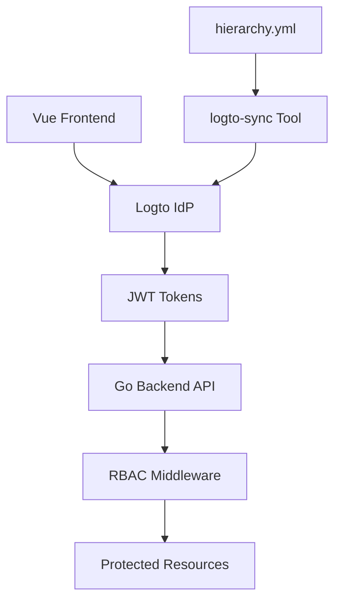
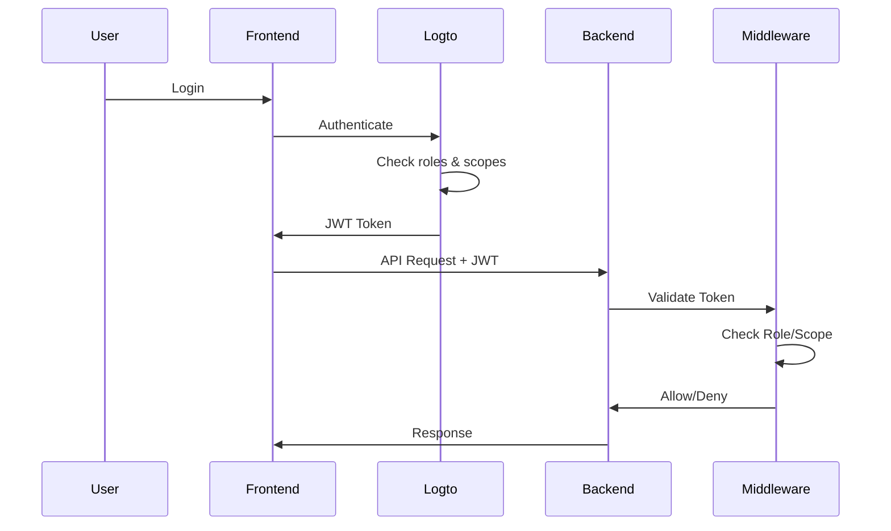

# 🔐 Nethesis Hierarchical RBAC System
*Role-Based Access Control for the Nethesis Ecosystem*

---

## 📋 **System Overview**

### **Architectural Components**


### **🎯 Objectives**
- **Hierarchical access control** for multi-level organizations
- **Automated permission management** based on roles
- **Granular security** for critical operations
- **Scalability** for ecosystem growth

---

## 🏢 **Organization Hierarchy**

### **Pyramid Structure**
```
                    🔱 GOD (Nethesis)
                          |
                    🌍 DISTRIBUTORS
                       /        \
                 📈 RESELLERS    📈 RESELLERS
                    /    \         /    \
              👥 CUSTOMERS    👥 CUSTOMERS
```

### **Permissions by Level**
| Role | Can Create | Can Manage | Can View |
|------|------------|------------|----------|
| **God** | Distributors | Everything | Everything |
| **Distributor** | Resellers, Customers | Sub-levels | Own hierarchy |
| **Reseller** | Customers | Own clients | Own clients |
| **Customer** | - | Own systems | Own data |

---

## 👥 **User Role System**

### **📊 Business Roles**
- **Sales**: Invoicing, renewals, self-service purchases, CRM
- **Marketing**: Campaigns, analytics, news
- **Operations**: Monitoring, training/courses, warehouse, shop

### **🔧 Technical Roles**
- **Admin**: Complete platform administration
- **Support**: System management, customer troubleshooting
- **Auditor**: Compliance, logs, security
- **Viewer**: Read-only access to systems

### **Permission Matrix by Domain**

#### **💻 Technical Systems**
| Role | Create | Read | Update | Delete | Manage | Destroy | Backup |
|------|:------:|:----:|:------:|:------:|:------:|:-------:|:------:|
| **Admin** | ✅ | ✅ | ✅ | ✅ | ✅ | ✅ | ✅ |
| **Support** | ✅ | ✅ | ✅ | ✅ | ✅ | ❌ | ✅ |
| **Operations** | ❌ | ✅ | ❌ | ❌ | ✅ | ❌ | ✅ |
| **Auditor** | ❌ | ✅ | ❌ | ❌ | ❌ | ❌ | ❌ |
| **Viewer** | ❌ | ✅ | ❌ | ❌ | ❌ | ❌ | ❌ |

#### **💰 Business & Finance**
| Role | Invoicing | Renewals | Self-Service | Reports | Analytics | CRM |
|------|:---------:|:--------:|:------------:|:-------:|:---------:|:---:|
| **Sales** | ✅ | ✅ | ✅ | ✅ | ✅ | ✅ |
| **Accounting** | ✅ | ❌ | ❌ | ✅ | ✅ | ❌ |
| **Marketing** | ❌ | ❌ | ❌ | ✅ | ✅ | ✅ |
| **Admin** | ✅ | ✅ | ✅ | ✅ | ✅ | ✅ |

---

## 🌐 **Third-Party Integrations**

### **Business Systems**
```yaml
Sales:
  - Stripe/PayPal      → Self-service payments
  - HubSpot/Salesforce → CRM and lead management

Operations:
  - Moodle/Canvas      → Training platform, webinars
  - Wordpress/Woocommerce        → Shop
  - Stock        → Warehouse
  - Freshdesk/Helpdesk  → Knowledge base, FAQ

Accounting:
  - Webcontract/Business   → Accounting management
  - Stripe Billing     → Subscription management
```

---

## 🔧 **Hybrid Approach: Roles + Scopes**

### **🎯 Design Philosophy**
```
📱 Standard Operations → ROLES (Simple, Clean)
⚠️  Critical Operations → SCOPES (Granular, Secure)
```

### **Implementation**
```go
// ✅ Standard CRUD - Role-based (elegant)
systemsGroup := protected.Group("/systems", middleware.AutoRoleRBAC("Support"))
{
    systemsGroup.POST("", methods.CreateSystem)     // Support role
    systemsGroup.GET("", methods.GetSystems)        // Support role
    systemsGroup.PUT("/:id", methods.UpdateSystem)  // Support role
    systemsGroup.DELETE("/:id", methods.DeleteSystem) // Support role
}

// ⚠️ Critical Operations - Scope-based (granular)
systemsSpecial := protected.Group("/systems")
{
    systemsSpecial.POST("/:id/factory-reset",
        middleware.RequireScope("admin:systems"), methods.FactoryResetSystem)
    systemsSpecial.DELETE("/:id/destroy",
        middleware.RequireScope("destroy:systems"), methods.DestroySystem)
    systemsSpecial.POST("/:id/restart",
        middleware.RequireScope("manage:systems"), methods.RestartSystem)
}

// 🏢 Organization Hierarchy - Organization role-based
distributorsGroup := protected.Group("/distributors", middleware.AutoOrganizationRoleRBAC("God"))
{
    distributorsGroup.POST("", methods.CreateDistributor)
    distributorsGroup.GET("", methods.GetDistributors)
}

// Mixed hierarchy access
resellersGroup := protected.Group("/resellers", middleware.RequireAnyOrganizationRole("God", "Distributor"))
{
    resellersGroup.POST("", methods.CreateReseller)
    resellersGroup.GET("", methods.GetResellers)
}
```

---

## 🔄 **Authentication Flow**

### **Step by Step**


### **JWT Token Content**
```json
{
  "sub": "user123",
  "username": "mario.rossi",
  "roles": ["Support"],                    // User roles
  "scopes": ["create:systems", "read:systems"], // User scopes (array)
  "organization_roles": ["Distributor"],   // Org roles
  "organization_scopes": ["create:resellers"] // Org scopes
}
```

---

## 📊 **Practical Examples**

### **Scenario 1: System Management**
```bash
# ✅ Support can manage systems
curl -X POST /api/systems \
  -H "Authorization: Bearer <support-token>" \
  -d '{"name":"server-prod","type":"linux"}'

# ❌ Support CANNOT perform factory reset
curl -X POST /api/systems/123/factory-reset \
  -H "Authorization: Bearer <support-token>"
# → 403 Forbidden: insufficient scope permissions (admin:systems required)

# ✅ Admin can perform factory reset
curl -X POST /api/systems/123/factory-reset \
  -H "Authorization: Bearer <admin-token>"
# → 200 OK: factory reset initiated
```

### **Scenario 2: Commercial Hierarchy**
```bash
# ✅ Distributor can create reseller
curl -X POST /api/resellers \
  -H "Authorization: Bearer <distributor-token>"

# ❌ Reseller CANNOT create other resellers
curl -X POST /api/resellers \
  -H "Authorization: Bearer <reseller-token>"
# → 403 Forbidden: insufficient organization role

# ✅ Reseller can create customer
curl -X POST /api/customers \
  -H "Authorization: Bearer <reseller-token>"
```

### **Scenario 3: Business Operations**
```bash
# ✅ Sales can create renewal invoice
curl -X POST /api/invoices \
  -H "Authorization: Bearer <sales-token>" \
  -d '{"customer_id":"123","type":"renewal","amount":1200}'

# ✅ Sales can enable self-service for product
curl -X POST /api/products/firewall/enable-selfservice \
  -H "Authorization: Bearer <sales-token>"

# ✅ Operations can create training course
curl -X POST /api/training/courses \
  -H "Authorization: Bearer <operations-token>" \
  -d '{"title":"NethSecurity Advanced","duration":"4h"}'

# ❌ Support CANNOT view financial reports
curl -X GET /api/reports/revenue \
  -H "Authorization: Bearer <support-token>"
# → 403 Forbidden: insufficient scope permissions (read:financials required)
```

### **Scenario 4: Granular Controls**
```bash
# ✅ Auditor can view system logs
curl -X GET /api/systems/123/logs \
  -H "Authorization: Bearer <auditor-token>"

# ❌ Marketing CANNOT view sensitive customer data
curl -X GET /api/customers/123/systems \
  -H "Authorization: Bearer <marketing-token>"
# → 403 Forbidden: insufficient scope permissions (read:systems required)

# ✅ Accounting can generate billing reports
curl -X GET /api/reports/billing/Q1-2025 \
  -H "Authorization: Bearer <accounting-token>"
```

---

## ⚙️ **Configuration and Sync**

### **hierarchy.yml → Logto**
```yaml
metadata:
  name: "nethesis-hierarchy-clean"
  version: "2.0.0"
  description: "Clean hierarchy configuration for Nethesis ecosystem"

hierarchy:
  organization_roles:
    - id: god
      name: "God"
      priority: 1
      permissions:
        - id: create:distributors
        - id: manage:distributors
        - id: destroy:distributors
        - id: admin:financials

    - id: distributor
      name: "Distributor"
      priority: 2
      permissions:
        - id: create:resellers
        - id: manage:resellers
        - id: create:customers
        - id: read:financials

  user_roles:
    - id: admin
      name: "Admin"
      priority: 1
      permissions:
        - id: admin:systems
        - id: destroy:systems
        - id: admin:financials

    - id: sales
      name: "Sales"
      priority: 3
      permissions:
        - id: create:invoices
        - id: manage:renewals
        - id: enable:selfservice
        - id: manage:crm

  resources:
    - name: "systems"
      actions: ["create", "read", "update", "delete", "manage", "admin", "destroy", "backup", "audit"]

    - name: "distributors"
      actions: ["create", "read", "update", "delete", "manage", "destroy"]
```

### **Synchronization Tool**
```bash
# Automatic sync with Logto
logto-sync sync -c hierarchy.yml

# Output:
✅ Creating user role: Sales
✅ Assigning scope: create:invoices to Sales
✅ Creating user role: Operations
✅ Assigning scope: create:training to Operations
✅ Creating user role: Marketing
✅ Assigning scope: manage:campaigns to Marketing
✅ Creating organization role: Distributor
✅ Sync completed successfully!

# Dry run to preview changes
logto-sync sync -c hierarchy.yml --dry-run --verbose

# Cleanup unused roles/scopes
logto-sync sync -c hierarchy.yml --cleanup
```

---

## ❓ **Q&A**

### **Technical FAQ**
**Q: How do we handle hierarchy changes?**
A: Automatic sync with Logto, real-time permission propagation

**Q: What happens if Logto is offline?**
A: JWT tokens continue to work with our server, only new logins won't work

---

*🔐 **Nethesis RBAC System** - Enterprise Security, Developer Simplicity*