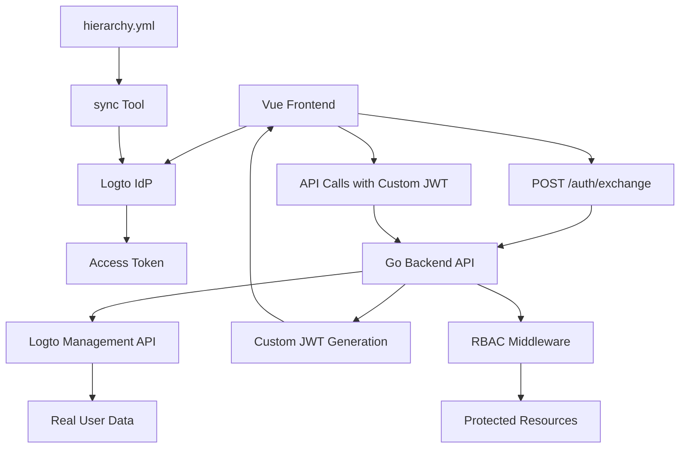
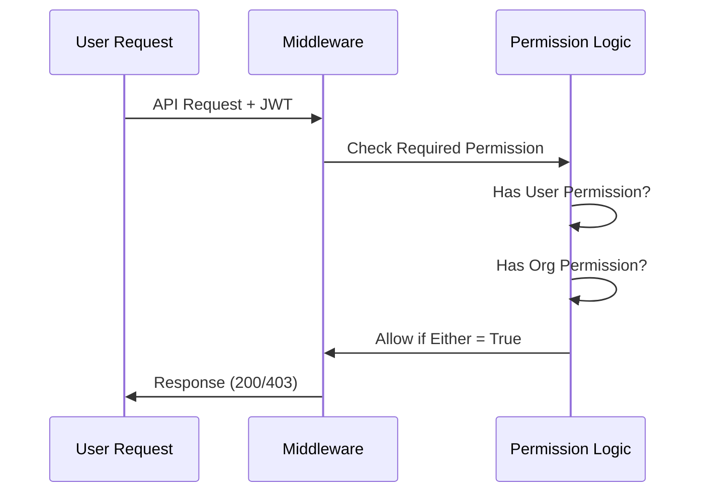
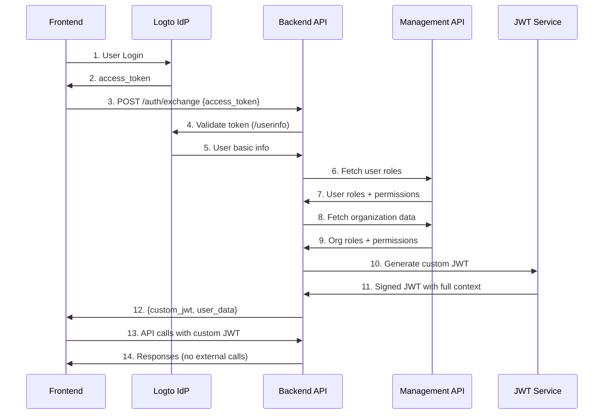

# 🔐 Nethesis Simplified RBAC System
*Clean Role-Based Access Control with Business Logic Separation*

---

## 📋 **System Overview**

### **Architectural Components**


### **🎯 Objectives**
- **Clear separation** between business hierarchy and technical capabilities
- **Real-time data integration** via Logto Management API
- **Performance optimization** through token exchange and JWT embedding
- **Simplified permission model** with direct role-to-permission mapping
- **Intuitive authorization** combining organization and user roles
- **Scalable architecture** for ecosystem growth

---

## 🏢 **Business Hierarchy (Organization Roles)**

### **Commercial Chain Structure**
```
                    🔱 GOD (Nethesis)
                          |
                    🌍 DISTRIBUTORS
                       /        \
                 📈 RESELLERS    📈 RESELLERS
                    /    \         /    \
              👥 CUSTOMERS    👥 CUSTOMERS
```

### **Organization Roles & Business Logic**
| Role | Can Create | Can Manage | Inherited From |
|------|------------|------------|----------------|
| **God** | Distributors, Resellers, Customers | Everything | Direct assignment |
| **Distributor** | Resellers, Customers | Sub-levels | Organization membership |
| **Reseller** | Customers | Own clients | Organization membership |
| **Customer** | - | Own data | Organization membership |

**Key Principle**: Users **inherit** their organization's business role and permissions automatically.

---

## 👥 **Technical Capabilities (User Roles)**

### **Role Categories**

#### **🔧 Technical Operations**
- **Admin**: Complete platform administration, dangerous operations
- **Support**: System management, customer troubleshooting, standard operations


### **Permission Matrix**

#### **Technical Systems (MVP)**
| Role | Systems Read | Systems Manage | Systems Admin | Systems Destroy |
|------|:------------:|:--------------:|:-------------:|:---------------:|
| **Admin** | ✅ | ✅ | ✅ | ✅ |
| **Support** | ✅ | ✅ | ❌ | ❌ |

---

## 🎯 **Simplified Architecture**

### **Permission Logic**
```
Final User Permissions = Organization Role Permissions + User Role Permissions
```

### **Real-World Examples**

#### **Example 1: Marco (ACME Reseller + Admin)**
```yaml
Organization: "ACME" (type: Reseller)
Organization Role: "Reseller"
User Roles: ["Admin"]

Resulting Permissions:
  # From Organization Role (Business Logic)
  - create:customers
  - manage:customers
  - read:own-customers
  
  # From User Role (Technical Capabilities)  
  - admin:systems
  - destroy:systems
  - manage:systems
  - read:systems
```

### **Data Visibility & Isolation**

The system implements hierarchical data visibility based on organization roles and creation relationships:

#### **Visibility Rules**
- **God**: Can see all distributors, resellers, and customers regardless of who created them
- **Distributors**: Can see only:
  - Resellers they created (`customData.createdBy = distributor.organizationId`)
  - Customers created by their resellers (transitively)
- **Resellers**: Can see only:
  - Customers they created (`customData.createdBy = reseller.organizationId`)
- **Customers**: Cannot access organization management endpoints

#### **CustomData Structure**
When organizations are created, they include visibility metadata:
```json
{
  "customData": {
    "createdBy": "creating-organization-id",
    "createdByRole": "Distributor"
  }
}
```

#### **Visibility Examples**
```yaml
# Distributor "Nethesis" creates Reseller "ACME"
ACME Reseller:
  customData:
    createdBy: "nethesis-org-id"
    createdByRole: "Distributor"

# Reseller "ACME" creates Customer "TechCorp"  
TechCorp Customer:
  customData:
    createdBy: "acme-org-id"
    createdByRole: "Reseller"

# Visibility Results:
# God: Sees Nethesis, ACME, TechCorp
# Nethesis Distributor: Sees ACME (created by them), TechCorp (created by their reseller)
# ACME Reseller: Sees only TechCorp (created by them)
# TechCorp Customer: Cannot access organization endpoints
```

#### **Example 2: Edoardo (Nethesis Distributor + Support)**
```yaml
Organization: "Nethesis" (type: Distributor)  
Organization Role: "Distributor"
User Roles: ["Support"]

Resulting Permissions:
  # From Organization Role (Business Logic)
  - create:resellers
  - manage:resellers
  - create:customers
  - manage:customers
  
  # From User Role (Technical Capabilities)
  - manage:systems
  - read:systems
```

---

## 🔧 **Implementation**

### **User Model Structure**
```go
type User struct {
    ID               string   `json:"id"`
    Username         string   `json:"username"`
    Email            string   `json:"email"`
    
    // Technical capabilities (what the user can DO)
    UserRoles        []string `json:"user_roles"`        // ["Admin", "Support"]
    UserPermissions  []string `json:"user_permissions"`  // Derived from roles
    
    // Business hierarchy (what the organization allows)
    OrgRole          string   `json:"org_role"`          // "Distributor"
    OrgPermissions   []string `json:"org_permissions"`   // Derived from org role
    OrganizationID   string   `json:"organization_id"`   // "nethesis-001"
    OrganizationName string   `json:"organization_name"` // "Nethesis S.r.l."
}
```

### **Middleware Usage**
```go
// ✅ Technical capability groups - role-based
systemsGroup := protected.Group("/systems",
    middleware.RequireUserRole("Support"))

// ✅ Business hierarchy groups - organization role-based
distributorsGroup := protected.Group("/distributors", 
    middleware.RequireOrgRole("God")) // Only God can manage distributors

resellersGroup := protected.Group("/resellers", 
    middleware.RequireAnyOrgRole("God", "Distributor")) // God + Distributors manage resellers

customersGroup := protected.Group("/customers", 
    middleware.RequireAnyOrgRole("God", "Distributor", "Reseller")) // All levels manage customers

// ✅ Specific operations - explicit permissions
systemsGroup.POST("/:id/restart", 
    middleware.RequirePermission("manage:systems"), methods.RestartSystem)

// ✅ Admin-only operations - explicit admin permissions
systemsGroup.DELETE("/:id", 
    middleware.RequirePermission("admin:systems"), methods.DeleteSystem)
```

### **Permission Flow**


---

## 📊 **Practical Scenarios**

### **Scenario 1: System Management**
```bash
# ✅ Support can manage systems (User Role permission)
curl -X POST /api/systems/123/restart \
  -H "Authorization: Bearer <support-token>"
# → 200 OK (has manage:systems from Support role)

# ✅ Distributor can create resellers (Organization Role permission)  
curl -X POST /api/resellers \
  -H "Authorization: Bearer <distributor-token>"
# → 200 OK (has create:resellers from Distributor org role)

# ❌ Customer cannot create distributors (lacks both permissions)
curl -X POST /api/distributors \
  -H "Authorization: Bearer <customer-token>"
# → 403 Forbidden (no create:distributors permission)
```

### **Scenario 2: Combined Permissions**
```bash
# ✅ Reseller + Admin can manage customer systems
curl -X POST /api/customers/123/systems/restart \
  -H "Authorization: Bearer <reseller-admin-token>"
# → 200 OK (create:customers from org + admin:systems from user role)

# ❌ Customer + Support cannot destroy systems
curl -X DELETE /api/systems/123/destroy \
  -H "Authorization: Bearer <customer-support-token>"  
# → 403 Forbidden (has read:systems but NOT destroy:systems)
```

---

## ⚙️ **Configuration**

### **hierarchy.yml Structure**
```yaml
metadata:
  name: "nethesis-simplified-rbac"
  version: "2.0.0"

hierarchy:
  # BUSINESS HIERARCHY (Organization Types)
  organization_roles:
    - id: god
      permissions:
        - create:distributors
        - manage:distributors
        - create:resellers
        - manage:resellers
        - create:customers
        - manage:customers
        
    - id: distributor
      permissions:
        - create:resellers
        - manage:resellers
        - create:customers
        - manage:customers
        
    - id: reseller
      permissions:
        - create:customers
        - manage:customers
        
    - id: customer
      permissions:
        - read:own-data

  # TECHNICAL CAPABILITIES (User Skills)
  user_roles:
    - id: admin
      permissions:
        - admin:systems
        - manage:systems
        - destroy:systems
        - read:systems
        
    - id: support
      permissions:
        - manage:systems
        - read:systems
        
```

### **Synchronization**
```bash
# Deploy new configuration
sync sync -c hierarchy.yml

# Preview changes  
sync sync -c hierarchy.yml --dry-run --verbose

# Output:
✅ Creating organization role: Distributor
✅ Creating user role: Admin  
✅ Assigning permission: admin:systems to Admin
✅ Creating user role: Support
✅ Sync completed successfully!
```

---

## 🔄 **Token Exchange System**

### **Architecture Overview**

The system implements a sophisticated **token exchange pattern** that combines Logto authentication with real-time Management API data fetching for optimal performance and security.

### **Authentication Flow**



### **Management API Integration**

#### **Data Fetching Process**
1. **User Roles (Technical Capabilities)**
   - `GET /users/{id}/roles` → Fetch assigned user roles
   - `GET /roles/{id}/scopes` → Fetch permissions for each role
   - Result: `["Admin"]` → `["admin:systems", "destroy:systems", "manage:systems", "read:systems"]`

2. **Organization Data (Business Hierarchy)**
   - `GET /users/{id}/organizations` → Fetch user's organizations
   - `GET /organizations/{orgId}/users/{userId}/roles` → Fetch org roles
   - `GET /organization-roles/{roleId}/scopes` → Fetch org permissions
   - Result: `"Distributor"` → `["create:resellers", "manage:resellers", "create:customers", "manage:customers"]`

#### **Real Data in JWT**
```json
{
  "user": {
    "id": "real-user-id",
    "username": "marco.rossi",
    "email": "marco@acme.com",
    "user_roles": ["Admin"],
    "user_permissions": ["admin:systems", "destroy:systems", "manage:systems", "read:systems"],
    "org_role": "Distributor",
    "org_permissions": ["create:resellers", "manage:resellers", "create:customers", "manage:customers"],
    "organization_id": "acme-distributor-123",
    "organization_name": "ACME Distribution"
  }
}
```

### **Performance Benefits**

| Aspect | Before (Direct Logto) | After (Token Exchange) |
|--------|----------------------|----------------------|
| **API Calls per Request** | 1-3 (JWKS + custom script) | 0 (local JWT validation) |
| **Permission Resolution** | Real-time script execution | Pre-computed in JWT |
| **Network Latency** | Every request | Only during exchange |
| **Scalability** | Limited by Logto performance | Limited by backend only |
| **Caching** | Logto-dependent | Full control |

### **Security Model**

1. **Logto Access Token**: Used only for initial validation and data fetching
2. **Custom JWT**: Contains complete user context, signed with backend secret
3. **Permission Embedding**: All permissions pre-computed and embedded
4. **Token Expiration**: Configurable (24h default) for permission refresh
5. **Management API**: Secured with machine-to-machine credentials

---

## 🔄 **Migration Benefits**

### **Before (Complex)**
- 4 separate permission arrays per user
- Multiple middleware types (user_rbac, org_rbac, etc.)
- Confusing scope/role duplication
- Hard to understand permission logic

### **After (Simplified)**
- 2 clear permission sources (User + Organization)
- Single unified middleware
- Clear separation: Business vs Technical
- Intuitive permission inheritance

### **Backward Compatibility**
- All existing middleware functions maintained as aliases
- Gradual migration path available
- No breaking changes to API endpoints

---

## ❓ **Q&A**

**Q: How does a user get Organization Role permissions?**
A: Automatically fetched from Logto Management API based on their organization membership and role assignment in that organization.

**Q: Can a user have multiple User Roles?**  
A: Yes! A user can be both "Support" and "Admin", getting permissions from both roles. The system fetches all assigned roles and combines their permissions.

**Q: When are permissions updated?**
A: Permissions are fetched fresh from Logto during token exchange and embedded in the JWT. They update when the JWT expires (24h default) and user does a new token exchange.

**Q: What if Management API is unavailable?**
A: The system gracefully handles failures - token exchange will still work with basic user info, but may have limited permissions until Management API is available again.

**Q: How are permissions synchronized between sync and the backend?**
A: `sync` manages the RBAC structure in Logto, while the backend fetches the current state via Management API. This ensures permissions are always current and reflect any changes made in Logto admin console.

**Q: What if I need very specific permission combinations?**
A: Use `RequirePermission("specific:permission")` - it checks both User and Organization permissions that were fetched from Logto.

---

*🔐 **Nethesis Simplified RBAC** - Business Logic Clarity, Technical Flexibility*