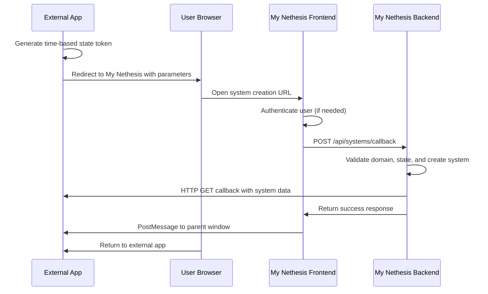

# Callback System Examples

This directory contains examples and documentation for the My Nethesis OAuth-style callback system for external system creation integration.

## Overview

The callback system allows external applications to:
1. **Redirect users** to My Nethesis for system creation
2. **Receive automatic callbacks** with system information
3. **Integrate system provisioning** into their own workflows
4. **Maintain security** through multiple protection layers

## Security Features

The callback system implements **robust security protection**:

- **Time-based Expiration**: State tokens expire after 1 hour
- **One-shot Protection**: Each state token can only be used once (24-hour blacklist)
- **CSRF Protection**: State validation prevents cross-site request forgery

## Callback Flow



## Example

### External Application Test Page
**File**: `test-callback-page.html`

A complete example of an external application that integrates My Nethesis system creation:

**Purpose**: Simulates a third-party application that wants to allow users to create systems via My Nethesis

**Features**:
- ✅ **Real external app simulation**: Demonstrates how a third-party would implement callbacks
- ✅ **Complete callback flow**: Shows the full OAuth-style integration pattern
- ✅ **Security implementation**: Time-based state tokens with validation
- ✅ **Dual callback methods**: URL parameters + PostMessage for maximum compatibility
- ✅ **Error handling**: Comprehensive error scenarios and user feedback
- ✅ **Production-ready code**: Ready to adapt for real external applications
- ✅ **Professional styling**: Clean, responsive interface
- ✅ **Advanced features**: Polling, window management, state validation

**Use Cases**:
- **Testing**: Verify callback functionality during development
- **Demo**: Show integration capabilities to partners
- **Template**: Base code for external applications to build upon

## Integration Guide

### 1. State Token Generation

Generate time-based state tokens using this format:

```javascript
function generateState() {
    const stateData = {
        timestamp: Date.now(),        // Current timestamp in milliseconds
        random: Math.random().toString(36).substring(2, 15) +
                Math.random().toString(36).substring(2, 15)
    };
    return 'state_' + btoa(JSON.stringify(stateData));
}
```

### 2. System Creation URL

Build the My Nethesis URL with callback parameters:

```javascript
const params = new URLSearchParams({
    callback_url: window.location.href,
    state: state,
    type: systemType,      // 'ns8' or 'nsec'
    name: systemName
});

const url = `https://your-my-instance.com/system-creation?${params.toString()}`;
```

### 3. Callback Handling

Handle callbacks via URL parameters:

```javascript
function checkForCallback() {
    const urlParams = new URLSearchParams(window.location.search);
    const state = urlParams.get('state');

    if (state && state === sessionStorage.getItem('callback_state')) {
        // Display results
        const systemId = urlParams.get('system_id');
        const systemName = urlParams.get('system_name');
        const systemType = urlParams.get('system_type');
        const timestamp = urlParams.get('timestamp');

        // Handle success...

        // Clean up
        sessionStorage.removeItem('callback_state');
        window.history.replaceState({}, document.title, window.location.pathname);
    }
}
```

### 4. PostMessage Alternative

Listen for PostMessage callbacks (works when URL callback fails):

```javascript
window.addEventListener('message', function(event) {
    if (event.data.type === 'system_created') {
        const expectedState = sessionStorage.getItem('callback_state');
        if (event.data.state === expectedState) {
            // Handle callback data
            console.log('System created:', event.data.system);
        }
    }
});
```

## Callback Parameters

When system creation is successful, your callback URL receives these query parameters:

```
GET https://your-app.com/callback?state=state_abc123&system_id=sys_456&system_name=My%20Server&system_type=ns8&timestamp=2025-09-05T10%3A30%3A00Z
```

**Parameters:**
- `state`: Your original state token for validation
- `system_id`: Unique system identifier
- `system_name`: System name (URL encoded)
- `system_type`: System type (`ns8`, `nsec`)
- `timestamp`: Creation timestamp (ISO 8601)

**Note**: System secrets are NOT included in callbacks for security reasons. They are only shown once during the creation confirmation.

## Error Handling

Handle these common error scenarios:

### Backend API Errors
- **`state token expired`**: Token is older than 1 hour
- **`state token already used`**: Token has already been used (replay attack)
- **`invalid state token format`**: Malformed state token

### Client-side Validation
```javascript
try {
    const encodedData = state.substring(6); // Remove 'state_' prefix
    const jsonData = atob(encodedData);
    const stateData = JSON.parse(jsonData);

    if (!stateData.timestamp || !stateData.random) {
        throw new Error('Invalid state structure');
    }

    // Check if token is expired (client-side pre-validation)
    const tokenAge = Date.now() - stateData.timestamp;
    const oneHourMs = 60 * 60 * 1000;
    if (tokenAge > oneHourMs) {
        throw new Error('State token expired');
    }
} catch (e) {
    console.error('Invalid state token:', e);
    // Handle error...
}
```

## API Reference

**Endpoint**: `POST /api/systems/callback`

See the [main backend OpenAPI documentation](../../openapi.yaml) for detailed request/response schemas.

## Testing

### Quick Test
```bash
# Open the minimal example
open minimal-callback-example.html

# Or open the full test page
open test-callback-page.html
```

### Local Development
1. Update the My Nethesis URL in the example files
2. Open the HTML files in your browser
3. Test the complete flow

## Security Considerations

### State Token Security
- **Entropy**: Uses `Date.now()` + double random strings for uniqueness
- **Expiration**: 1-hour window prevents long-term replay attacks
- **One-shot**: Redis blacklist prevents token reuse
- **Format**: Base64 JSON encoding prevents simple manipulation

### CSRF Protection
- **State Validation**: Prevents cross-site request forgery
- **Same-origin**: State tokens stored in sessionStorage
- **Cleanup**: Tokens removed after successful use

## Production Checklist

Before deploying to production:

- [ ] **HTTPS**: Ensure all URLs use HTTPS in production
- [ ] **State Storage**: Use sessionStorage (not localStorage) for state tokens
- [ ] **Error Handling**: Implement proper error handling for all scenarios
- [ ] **Cleanup**: Remove debug logging and test code
- [ ] **Testing**: Test all callback scenarios and error conditions
- [ ] **Security**: Review state token generation and validation logic
- [ ] **UX**: Provide clear feedback during the callback process

## Support

For questions or issues with the callback system:

1. Review the [main backend API documentation](../../README.md)
2. Check the [OpenAPI specification](../../openapi.yaml)
3. Test with the provided examples
4. Review server logs for detailed error information