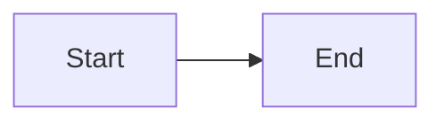

# Contributing to My Nethesis Documentation

How to write, translate, build and publish these pages.

## Documentation Structure

```
docs/
  docs/                    # English documentation (default locale)
    intro.md
    getting-started/
      authentication.md
      account.md
      api-keys.md
    platform/
      organizations.md
      users.md
      impersonation.md
    systems/
      management.md
      registration.md
      inventory-heartbeat.md
      backups.md
      org-reassignment.md
    features/
      dashboard.md
      applications.md
      entitlements.md
      avatar.md
      rebranding.md
      import.md
      export.md
      alerting.md
    contributing.md
  i18n/
    it/
      docusaurus-plugin-content-docs/
        current/           # Italian translation
          ...              # Same structure as docs/
      docusaurus-theme-classic/
                           # Navbar and footer strings (JSON)
  sidebars.ts              # Sidebar definition, shared by both locales
  docusaurus.config.ts     # Site configuration
  static/img/              # Images
```

Every page must exist in **both** locales with the same structure: the sidebar
is shared, so a page missing from one locale breaks navigation there.

## Prerequisites

- Node.js 24 or later (see `engines` in `package.json`)

## Local Development

The project drives everything through `make`; each target wraps the npm script
underneath.

### Install Dependencies

```bash
cd docs
make install          # npm ci, from the lockfile
```

### Start the Dev Server

```bash
make run                   # npm start -- English, with hot reload
npm start -- --locale it   # Italian
```

The dev server listens on `http://localhost:3000`.

:::note
The dev server serves **one locale at a time**. To check the Italian pages you
have to restart it with `--locale it`, or build the whole site.
:::

### Build

```bash
make build            # builds every locale into build/
```

The build **fails on broken links**, so it is the check that catches dead
cross-references.

### Preview the Build

```bash
make serve
```

### Before Committing

```bash
make pre-commit       # type-check + build + dependency audit
```

## Writing Guidelines

### Style

- Write in the second person ("you"), present tense
- Prefer short sentences and concrete examples
- Document what the platform **does**, not what it is meant to do
- Always show complete commands, never fragments

### Page Structure

```markdown
---
sidebar_position: 1
---

# Page Title

One-line introduction to the page.

## Main Section

Content.

### Subsection

Details.

## Troubleshooting

Common problems and solutions.

## Related Documentation

- [Link to related page](./other-page.md)
```

### Frontmatter

Every page starts with a frontmatter block. `sidebar_position` decides the order
inside its category; keep the same value in both locales.

### Admonitions

Docusaurus supports these callouts:

```markdown
:::note
Neutral information.
:::

:::tip
A useful suggestion.
:::

:::info
Additional context.
:::

:::warning
Something that needs care.
:::

:::danger
Irreversible or risky operation.
:::
```

### Internal Links

Link to the **source file**, with the `./` or `../` prefix and the `.md`
extension:

```markdown
[Authentication](./getting-started/authentication.md)
[Systems Management](../systems/management.md)
[A section](./management.md#creating-systems)
```

:::warning
Never link with an extensionless path such as `[Authentication](getting-started/authentication)`.
Docusaurus passes those through untouched and the **browser** resolves them
against the page URL, so they break as soon as that URL carries a trailing
slash -- and the build cannot catch it. A file-relative `.md` link is resolved
at build time, which turns a missing target into a build failure.

Anchors are generated from the heading text, so they differ between locales:
the Italian page links `./management.md#creazione-sistemi`, not the English
`#creating-systems`.
:::

### Images

Images live in `static/img/` and are referenced from the site root:

```markdown

```

Keep them under 1 MB and give every image real alt text.

### Tables

Use Markdown tables for structured data:

```markdown
| Column 1 | Column 2 | Column 3 |
|----------|----------|----------|
| Value 1  | Value 2  | Value 3  |
```

### Mermaid Diagrams

Mermaid is enabled site-wide:

````markdown

````

### Command Examples

Show the whole command, and both sides of an API call:

````markdown
```bash
curl -X POST https://api.example.com/endpoint \
  -H "Content-Type: application/json" \
  -d '{"key": "value"}'
```
````

Use paths relative to the repository root -- `backend/main.go`, not a path from
your own machine.

## Adding a New Page

1. **Create the file** in the right `docs/` subdirectory, and its counterpart
   under `i18n/it/docusaurus-plugin-content-docs/current/`
2. **Add the frontmatter**, with the same `sidebar_position` in both locales
3. **Register it in `sidebars.ts`** -- the sidebar is shared by both locales
4. **Link it** from the related pages, on both sides

## Translations

### Adding an Italian Translation

1. Create the file in the matching directory under
   `i18n/it/docusaurus-plugin-content-docs/current/`
2. Keep the same structure and the same frontmatter as the English file
3. Translate everything: headings, body, image alt text
4. Leave code blocks untouched -- never translate code, flags or identifiers
5. Keep the links file-relative, adjusting only the **anchors**, which follow
   the translated headings
6. Use proper accented characters (è, può, così), not `e'` or `puo'`

### Interface Translations

Navbar and footer strings live in the JSON files under
`i18n/it/docusaurus-theme-classic/`. Regenerate them with:

```bash
make translations
```

## Review Process

1. Make your changes in a feature branch
2. Preview locally with `make run`
3. Make sure `make pre-commit` passes
4. Open a Pull Request
5. Once approved and merged to `main`, deployment is automatic

## Deployment

Pushing to `main` triggers a GitHub Actions workflow that builds the site and
publishes it to GitHub Pages at `https://nethserver.github.io/my/`.

The API reference is a separate pipeline: it is generated from
`backend/openapi.yaml` and published to Bump.sh by its own workflow.

## Getting Help

- Look at the existing pages for examples
- Read the [Docusaurus documentation](https://docusaurus.io/docs)
- Ask in the project discussions

## License

Documentation contributions are covered by the same license as the project (AGPL-3.0-or-later).
