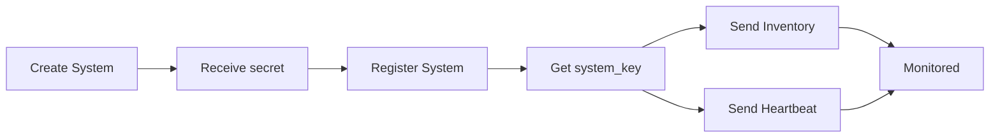

# Welcome to My

**My** is a centralized management platform by Nethesis that provides authentication, hierarchical organization management, system monitoring, and role-based access control.

## Key Features

- **Centralized Authentication** using Logto as Identity Provider
- **Hierarchical Organization Management** (Owner, Distributor, Reseller, Customer)
- **Role-Based Access Control (RBAC)** with dual-role system
- **System Monitoring** with real-time inventory and heartbeat tracking
- **Change Detection** with automatic diff analysis and severity levels
- **User Self-Service** with avatar management, profile editing, and password change
- **Data Export** in CSV and PDF formats
- **Organization Rebranding** with custom logos, favicons, and backgrounds per product
- **Application Management** with organization assignment

## Business Hierarchy

```
Owner (Nethesis)
    ↓
Distributors
    ↓
Resellers
    ↓
Customers
```

Each level manages only their downstream organizations.

## Dual-Role System

**Organization Roles** (business hierarchy): Owner, Distributor, Reseller, Customer

**User Roles** (technical capabilities): Super Admin, Admin, Backoffice, Support, Reader

Effective permissions = Organization Role + User Role

## System Lifecycle



## Quick Start

1. **[Log in](getting-started/authentication)** with your credentials
2. **[Set up your profile](getting-started/account)** and avatar
3. **[Create organizations](platform/organizations)** based on your business hierarchy
4. **[Add users](platform/users)** and assign appropriate roles
5. **[Create systems](systems/management)** for your customers
6. **[Register systems](systems/registration)** to enable monitoring

## Technology Stack

- **Backend**: Go 1.24+ with Gin framework
- **Database**: PostgreSQL with migrations
- **Cache**: Redis for high-performance caching
- **Identity**: Logto for authentication and RBAC
- **Frontend**: Vue.js 3 with TypeScript

## Developer Documentation

Technical documentation for developers and integrators:

- **[Backend API](https://github.com/NethServer/my/blob/main/backend/README.md)** - Go REST API server with JWT authentication
- **[Collect Service](https://github.com/NethServer/my/blob/main/collect/README.md)** - Inventory and heartbeat collection service
- **[Sync Tool](https://github.com/NethServer/my/blob/main/sync/README.md)** - RBAC synchronization CLI tool
- **[Project Overview](https://github.com/NethServer/my/blob/main/README.md)** - Complete project documentation and architecture

## Security

- **SHA256** salted secret hashing
- **Token Split Pattern** for system credentials
- **JWT-based** authentication with token blacklisting
- **RBAC** with hierarchical permissions

## Getting Help

### For Users

- Browse the documentation sections in the sidebar
- Check the troubleshooting sections in each guide
- Contact your system administrator

### For Developers

- Read the component-specific READMEs linked above
- Check the API documentation
- Review the architecture documentation in [DESIGN.md](https://github.com/NethServer/my/blob/main/DESIGN.md)
- Open an issue on [GitHub](https://github.com/NethServer/my/issues)

## Version Information

Current version: **0.6.0** (Pre-production)
