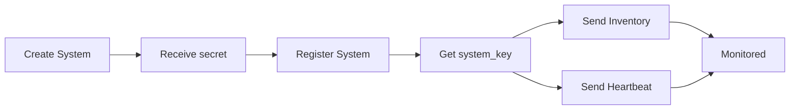

# Welcome to My Documentation

Complete user and developer documentation for **My** - the centralized management platform.

## What is My?

My is a comprehensive management platform that provides:

- **Centralized Authentication** using Logto as Identity Provider
- **Hierarchical Organization Management** (Owner, Distributor, Reseller, Customer)
- **Role-Based Access Control (RBAC)** with dual-role system
- **System Monitoring** with real-time inventory and heartbeat tracking
- **User Management** with automatic welcome emails and self-service features

## Documentation Structure

### 📚 User Guide

Complete guides for end users and administrators:

<div class="grid cards" markdown>

-   :material-login: **Getting Started**

    ---

    Learn how to log in, manage your profile, and understand user roles.

    [:octicons-arrow-right-24: Authentication Guide](01-authentication.md)

-   :material-office-building: **Organizations**

    ---

    Create and manage the business hierarchy: Distributors, Resellers, and Customers.

    [:octicons-arrow-right-24: Organizations Guide](02-organizations.md)

-   :material-account-group: **Users**

    ---

    Create users, assign roles, and manage permissions across your organization.

    [:octicons-arrow-right-24: Users Guide](03-users.md)

-   :material-server: **Systems**

    ---

    Create and monitor systems, view status, and manage system credentials.

    [:octicons-arrow-right-24: Systems Guide](04-systems.md)

-   :material-check-circle: **Registration**

    ---

    Register external systems with My platform using system secrets.

    [:octicons-arrow-right-24: Registration Guide](05-system-registration.md)

-   :material-chart-line: **Monitoring**

    ---

    Configure inventory collection and heartbeat monitoring for your systems.

    [:octicons-arrow-right-24: Inventory & Heartbeat](06-inventory-heartbeat.md)

</div>

### 💻 Developer Documentation

Technical documentation for developers and integrators:

- **[Backend API](https://github.com/NethServer/my/blob/main/backend/README.md)** - Go REST API server with JWT authentication
- **[Collect Service](https://github.com/NethServer/my/blob/main/collect/README.md)** - Inventory and heartbeat collection service
- **[Sync Tool](https://github.com/NethServer/my/blob/main/sync/README.md)** - RBAC synchronization CLI tool
- **[Project Overview](https://github.com/NethServer/my/blob/main/README.md)** - Complete project documentation and architecture

## Quick Start

### 🧑 For End Users

1. **[Log in](01-authentication.md)** with your credentials
2. **[Create organizations](02-organizations.md)** based on your business hierarchy
3. **[Add users](03-users.md)** and assign appropriate roles
4. **[Create systems](04-systems.md)** for your customers
5. **[Register systems](05-system-registration.md)** to enable monitoring

### 🧑‍💻 For Developers

1. Clone the repository
2. Read the [Project documentation](https://github.com/NethServer/my/blob/main/README.md)
3. Set up your development environment
4. Follow the [RBAC configuration guide](https://github.com/NethServer/my/blob/main/sync/README.md)

## Key Features

### 🔐 Security First

- **Argon2id** secret hashing (memory-hard, GPU-resistant)
- **Token Split Pattern** for system credentials
- **JWT-based** authentication with token blacklisting
- **RBAC** with hierarchical permissions

### 🏢 Business Hierarchy

```
Owner (Nethesis)
    ↓
Distributors
    ↓
Resellers
    ↓
Customers
```

Each level manages only their downstream organizations.

### 👥 Dual-Role System

**Organization Roles** (business hierarchy):
- Owner, Distributor, Reseller, Customer

**User Roles** (technical capabilities):
- Admin, Support, and more

Effective permissions = Organization Role + User Role

### 📊 Real-Time Monitoring

- **Heartbeat tracking** every 5 minutes
- **Inventory collection** every 6 hours
- **Automatic change detection** with diff analysis
- **Status indicators**: Active 🟢 / Inactive 🟡 / Unknown ⚪ / Deleted 🔴

### 🔄 System Lifecycle



## Getting Help

### For Users

- Browse the [User Guide](01-authentication.md) sections
- Check the troubleshooting sections in each guide
- Contact your system administrator

### For Developers

- Read the component-specific READMEs
- Check the API documentation
- Review the architecture documentation in [DESIGN.md](https://github.com/NethServer/my/blob/main/DESIGN.md)
- Open an issue on [GitHub](https://github.com/NethServer/my/issues)

## Technology Stack

- **Backend**: Go 1.24+ with Gin framework
- **Database**: PostgreSQL with migrations
- **Cache**: Redis for high-performance caching
- **Identity**: Logto for authentication and RBAC
- **Frontend**: Vue.js 3 (see separate repository)

## Version Information

Current version: **0.4.0** (Pre-production)

This documentation is continuously updated. Last update: 2025-11-06

---

<div class="grid cards" markdown>

-   :material-rocket-launch: **Ready to Start?**

    ---

    Begin with the authentication guide to log in and explore My.

    [:octicons-arrow-right-24: Get Started](01-authentication.md)

-   :material-github: **Contribute**

    ---

    My is open source. Contribute on GitHub!

    [:octicons-arrow-right-24: GitHub Repository](https://github.com/NethServer/my)

</div>
