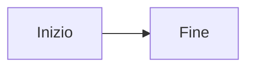

# Contribuire alla Documentazione My

Questa guida spiega come contribuire alla documentazione della piattaforma My.

## Struttura

La documentazione è organizzata con Docusaurus e segue questa struttura:

```
docs/
  docs/                    # Documentazione inglese (default)
    intro.md
    getting-started/
      authentication.md
      account.md
    platform/
      organizations.md
      users.md
      impersonation.md
    systems/
      management.md
      registration.md
      inventory-heartbeat.md
    features/
      dashboard.md
      applications.md
      avatar.md
      rebranding.md
      export.md
    contributing.md
  i18n/
    it/
      docusaurus-plugin-content-docs/
        current/           # Traduzione italiana
          ...              # Stessa struttura di docs/
      docusaurus-theme-classic/
        navbar.json        # Traduzioni navbar
        footer.json        # Traduzioni footer
  docusaurus.config.ts     # Configurazione Docusaurus
  sidebars.ts              # Configurazione sidebar
```

## Prerequisiti

- **Node.js** 20 o superiore
- **npm** (incluso con Node.js)

## Sviluppo Locale

### Installazione Dipendenze

```bash
cd docs
npm install
```

### Avvio Server di Sviluppo

```bash
# Documentazione inglese (default)
npm start

# Documentazione italiana
npm start -- --locale it
```

Il server di sviluppo si avvia su `http://localhost:3000` con hot-reload automatico.

### Build

```bash
npm run build
```

Il build genera il sito statico nella directory `build/`.

### Anteprima Build

```bash
npm run serve
```

## Linee Guida per la Scrittura

### Stile

- Usa un linguaggio chiaro e conciso
- Scrivi in seconda persona ("Vai a...", "Clicca su...")
- Evita gergo tecnico non necessario
- Fornisci esempi pratici quando possibile

### Struttura delle Pagine

Ogni pagina dovrebbe seguire questa struttura:

1. **Titolo** (H1) - Un unico titolo principale
2. **Introduzione** - Breve descrizione dell'argomento
3. **Sezioni** (H2) - Argomenti principali
4. **Sottosezioni** (H3) - Dettagli specifici
5. **Best Practice** - Consigli e raccomandazioni
6. **Risoluzione Problemi** - Problemi comuni e soluzioni

### Frontmatter

Ogni pagina deve avere il frontmatter YAML:

```yaml
---
sidebar_position: 1
---
```

### Admonition Docusaurus

Usa le admonition di Docusaurus per evidenziare informazioni importanti:

```markdown
:::note
Informazione aggiuntiva utile.
:::

:::tip
Suggerimento o best practice.
:::

:::warning
Attenzione a questo aspetto.
:::

:::danger
Pericolo! Operazione irreversibile o rischiosa.
:::
```

Risultato:

:::note
Informazione aggiuntiva utile.
:::

:::tip
Suggerimento o best practice.
:::

:::warning
Attenzione a questo aspetto.
:::

:::danger
Pericolo! Operazione irreversibile o rischiosa.
:::

### Link Interni

Usa link relativi per collegare le pagine:

```markdown
[Autenticazione](getting-started/authentication)
[Gestione Sistemi](systems/management)
```

### Immagini

Le immagini vanno nella directory `static/img/`:

```markdown

```

### Tabelle

Usa tabelle Markdown per presentare dati strutturati:

```markdown
| Colonna 1 | Colonna 2 | Colonna 3 |
|-----------|-----------|-----------|
| Valore 1  | Valore 2  | Valore 3  |
```

### Diagrammi Mermaid

Usa blocchi di codice Mermaid per i diagrammi:

````markdown

````

## Traduzioni

### Aggiungere una Traduzione Italiana

1. Crea il file nella directory corrispondente sotto `i18n/it/docusaurus-plugin-content-docs/current/`
2. Mantieni la stessa struttura e lo stesso frontmatter del file inglese
3. Traduci tutto il contenuto, inclusi titoli, descrizioni e testo alternativo delle immagini
4. Mantieni gli stessi blocchi di codice (non tradurre il codice)
5. Mantieni gli stessi link relativi

### Traduzioni dell'Interfaccia

Le traduzioni dei componenti dell'interfaccia (navbar, footer) sono nei file JSON sotto `i18n/it/docusaurus-theme-classic/`.

## Deployment

La documentazione viene pubblicata automaticamente su GitHub Pages tramite GitHub Actions al push sul branch `main`.

L'URL di pubblicazione è: `https://nethserver.github.io/my/`
