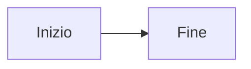

# Contribuire alla Documentazione My Nethesis

Come scrivere, tradurre, compilare e pubblicare queste pagine.

## Struttura della Documentazione

```
docs/
  docs/                    # Documentazione inglese (locale predefinita)
    intro.md
    getting-started/
      authentication.md
      account.md
      api-keys.md
    platform/
      organizations.md
      users.md
      impersonation.md
    systems/
      management.md
      registration.md
      inventory-heartbeat.md
      backups.md
      org-reassignment.md
    features/
      dashboard.md
      applications.md
      entitlements.md
      avatar.md
      rebranding.md
      import.md
      export.md
      alerting.md
    contributing.md
  i18n/
    it/
      docusaurus-plugin-content-docs/
        current/           # Traduzione italiana
          ...              # Stessa struttura di docs/
      docusaurus-theme-classic/
                           # Stringhe di navbar e footer (JSON)
  sidebars.ts              # Definizione della sidebar, condivisa dalle due locale
  docusaurus.config.ts     # Configurazione del sito
  static/img/              # Immagini
```

Ogni pagina deve esistere in **entrambe** le locale con la stessa struttura: la
sidebar è condivisa, quindi una pagina che manca da una locale rompe la
navigazione di quella locale.

## Prerequisiti

- Node.js 24 o superiore (vedi `engines` in `package.json`)

## Sviluppo Locale

Il progetto passa sempre da `make`; ogni target incapsula lo script npm
sottostante.

### Installazione Dipendenze

```bash
cd docs
make install          # npm ci, dal lockfile
```

### Avvio Server di Sviluppo

```bash
make run                   # npm start -- inglese, con hot reload
npm start -- --locale it   # italiano
```

Il server di sviluppo ascolta su `http://localhost:3000`.

:::note
Il server di sviluppo serve **una locale alla volta**. Per controllare le pagine
italiane bisogna riavviarlo con `--locale it`, oppure compilare tutto il sito.
:::

### Build

```bash
make build            # compila tutte le locale dentro build/
```

Il build **fallisce sui link rotti**: è il controllo che intercetta i
riferimenti incrociati morti.

### Anteprima del Build

```bash
make serve
```

### Prima di Committare

```bash
make pre-commit       # type-check + build + audit delle dipendenze
```

## Linee Guida per la Scrittura

### Stile

- Scrivi alla seconda persona, al presente
- Preferisci frasi brevi ed esempi concreti
- Documenta quello che la piattaforma **fa**, non quello che dovrebbe fare
- Mostra sempre i comandi completi, mai frammenti

### Struttura delle Pagine

```markdown
---
sidebar_position: 1
---

# Titolo Pagina

Introduzione di una riga alla pagina.

## Sezione Principale

Contenuto.

### Sottosezione

Dettagli.

## Risoluzione Problemi

Problemi comuni e soluzioni.

## Documentazione Correlata

- [Link a pagina correlata](./altra-pagina.md)
```

### Frontmatter

Ogni pagina inizia con un blocco di frontmatter. `sidebar_position` decide
l'ordine dentro la categoria: mantieni lo stesso valore in entrambe le locale.

### Admonition

Docusaurus supporta questi riquadri:

```markdown
:::note
Informazione neutra.
:::

:::tip
Un suggerimento utile.
:::

:::info
Contesto aggiuntivo.
:::

:::warning
Qualcosa che richiede attenzione.
:::

:::danger
Operazione irreversibile o rischiosa.
:::
```

### Link Interni

Collega il **file sorgente**, con il prefisso `./` o `../` e l'estensione
`.md`:

```markdown
[Autenticazione](./getting-started/authentication.md)
[Gestione Sistemi](../systems/management.md)
[Una sezione](./management.md#creazione-sistemi)
```

:::warning
Non usare mai un link senza estensione come `[Autenticazione](getting-started/authentication)`.
Docusaurus li lascia passare intatti e a risolverli è il **browser**, contro
l'URL della pagina corrente: si rompono appena quell'URL ha uno slash finale, e
il build non se ne accorge. Un link file-relative `.md` viene invece risolto in
fase di build, quindi un target mancante diventa un errore di compilazione.

Le anchor sono generate dal testo dei titoli, quindi cambiano da una locale
all'altra: la pagina italiana collega `./management.md#creazione-sistemi`, non
l'inglese `#creating-systems`.
:::

### Immagini

Le immagini vanno in `static/img/` e si referenziano dalla radice del sito:

```markdown

```

Tienile sotto 1 MB e dai a ognuna un testo alternativo vero.

### Tabelle

Usa tabelle Markdown per i dati strutturati:

```markdown
| Colonna 1 | Colonna 2 | Colonna 3 |
|-----------|-----------|-----------|
| Valore 1  | Valore 2  | Valore 3  |
```

### Diagrammi Mermaid

Mermaid è abilitato su tutto il sito:

````markdown

```mermaid
graph LR
    A[Inizio] --> B[Fine]
```
````

### Esempi di Comandi

Mostra il comando intero, e di una chiamata API mostra entrambi i lati:

````markdown
```bash
curl -X POST https://api.example.com/endpoint \
  -H "Content-Type: application/json" \
  -d '{"key": "value"}'
```
````

Usa percorsi relativi alla radice del repository -- `backend/main.go`, non un
percorso della tua macchina.

## Aggiungere una Nuova Pagina

1. **Crea il file** nella sottodirectory giusta di `docs/`, e il corrispondente
   sotto `i18n/it/docusaurus-plugin-content-docs/current/`
2. **Aggiungi il frontmatter**, con lo stesso `sidebar_position` in entrambe le locale
3. **Registrala in `sidebars.ts`** -- la sidebar è condivisa dalle due locale
4. **Collegala** dalle pagine correlate, da entrambe le parti

## Traduzioni

### Aggiungere una Traduzione Italiana

1. Crea il file nella directory corrispondente sotto
   `i18n/it/docusaurus-plugin-content-docs/current/`
2. Mantieni la stessa struttura e lo stesso frontmatter del file inglese
3. Traduci tutto: titoli, corpo, testo alternativo delle immagini
4. Lascia intatti i blocchi di codice -- non tradurre mai codice, flag o identificatori
5. Tieni i link file-relative, adattando solo le **anchor**, che seguono i
   titoli tradotti
6. Usa i caratteri accentati veri (è, può, così), non `e'` o `puo'`

### Traduzioni dell'Interfaccia

Le stringhe di navbar e footer stanno nei file JSON sotto
`i18n/it/docusaurus-theme-classic/`. Si rigenerano con:

```bash
make translations
```

## Processo di Revisione

1. Fai le modifiche in un branch dedicato
2. Guarda l'anteprima in locale con `make run`
3. Assicurati che `make pre-commit` passi
4. Apri una Pull Request
5. Una volta approvata e mergiata su `main`, la pubblicazione è automatica

## Deployment

Il push su `main` innesca una GitHub Actions che compila il sito e lo pubblica
su GitHub Pages, all'indirizzo `https://nethserver.github.io/my/`.

L'API reference è una pipeline separata: viene generata da
`backend/openapi.yaml` e pubblicata su Bump.sh da un workflow dedicato.

## Come Ottenere Aiuto

- Guarda le pagine esistenti come esempio
- Leggi la [documentazione Docusaurus](https://docusaurus.io/docs)
- Chiedi nelle discussioni del progetto

## Licenza

I contributi alla documentazione sono coperti dalla stessa licenza del progetto (AGPL-3.0-or-later).
