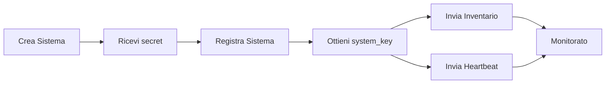

# Benvenuto in My

**My** è una piattaforma di gestione centralizzata di Nethesis che fornisce autenticazione, gestione gerarchica delle organizzazioni, monitoraggio dei sistemi e controllo degli accessi basato sui ruoli.

## Funzionalità Principali

- **Autenticazione Centralizzata** tramite Logto come Identity Provider
- **Gestione Organizzativa Gerarchica** (Owner, Distributore, Rivenditore, Cliente)
- **Controllo degli Accessi Basato sui Ruoli (RBAC)** con sistema a doppio ruolo
- **Monitoraggio Sistemi** con inventario in tempo reale e tracciamento heartbeat
- **Rilevamento Modifiche** con analisi automatica delle differenze e livelli di severità
- **Self-Service Utente** con gestione avatar, modifica profilo e cambio password
- **Esportazione Dati** in formato CSV e PDF
- **Rebranding Organizzazione** con loghi personalizzati, favicon e sfondi per prodotto
- **Gestione Applicazioni** con assegnazione alle organizzazioni

## Gerarchia Aziendale

```
Owner (Nethesis)
    ↓
Distributori
    ↓
Rivenditori
    ↓
Clienti
```

Ogni livello gestisce solo le organizzazioni subordinate.

## Sistema a Doppio Ruolo

**Ruoli Organizzazione** (gerarchia aziendale): Owner, Distributore, Rivenditore, Cliente

**Ruoli Utente** (capacità tecniche): Super Admin, Admin, Backoffice, Support, Reader

Permessi effettivi = Ruolo Organizzazione + Ruolo Utente

## Ciclo di Vita del Sistema



## Guida Rapida

1. **[Accedi](getting-started/authentication)** con le tue credenziali
2. **[Configura il tuo profilo](getting-started/account)** e l'avatar
3. **[Crea le organizzazioni](platform/organizations)** in base alla tua gerarchia aziendale
4. **[Aggiungi utenti](platform/users)** e assegna i ruoli appropriati
5. **[Crea i sistemi](systems/management)** per i tuoi clienti
6. **[Registra i sistemi](systems/registration)** per abilitare il monitoraggio

## Documentazione Sviluppatori

Documentazione tecnica per sviluppatori e integratori:

- **[API Backend](https://github.com/NethServer/my/blob/main/backend/README.md)** - Server API REST Go con autenticazione JWT
- **[Servizio Collect](https://github.com/NethServer/my/blob/main/collect/README.md)** - Servizio raccolta inventario e heartbeat
- **[Tool Sync](https://github.com/NethServer/my/blob/main/sync/README.md)** - Tool CLI per sincronizzazione RBAC
- **[Panoramica Progetto](https://github.com/NethServer/my/blob/main/README.md)** - Documentazione completa del progetto e architettura

## Ottenere Aiuto

### Per Utenti

- Esplora le sezioni della guida utente partendo da [Autenticazione](getting-started/authentication)
- Controlla le sezioni di risoluzione problemi in ogni guida
- Contatta il tuo amministratore di sistema

### Per Sviluppatori

- Leggi i README specifici dei componenti
- Consulta la documentazione API
- Rivedi la documentazione architettura in [DESIGN.md](https://github.com/NethServer/my/blob/main/DESIGN.md)
- Apri un issue su [GitHub](https://github.com/NethServer/my/issues)

## Sicurezza

- **SHA256** hashing salato dei secret
- **Token Split Pattern** per credenziali di sistema
- Autenticazione **basata su JWT** con blacklist token
- **RBAC gerarchico** con permessi combinati organizzazione + utente

## Informazioni Versione

Versione corrente: **0.6.1** (Pre-produzione)

## Stack Tecnologico

- **Backend**: Go 1.24+ con framework Gin
- **Database**: PostgreSQL con migrazioni
- **Cache**: Redis per caching ad alte prestazioni
- **Identity**: Logto per autenticazione e RBAC
- **Frontend**: Vue.js 3 con TypeScript
