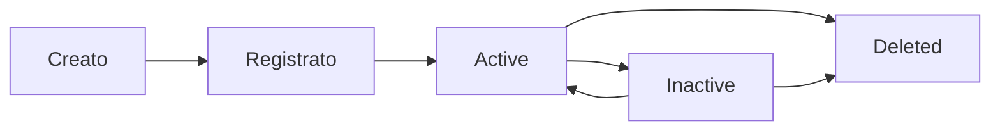

# Gestione Sistemi

I sistemi rappresentano le installazioni software monitorate dalla piattaforma My. Ogni sistema è associato a un'organizzazione e può inviare dati di inventario e heartbeat.

## Comprendere i Sistemi

Un sistema in My rappresenta un'installazione di NethServer o NethSecurity presso un cliente. Ogni sistema:

- Appartiene a una **singola organizzazione**
- Ha credenziali uniche (**system_key** e **system_secret**) per l'autenticazione
- Invia periodicamente dati di **inventario** e **heartbeat**
- Ha un **ciclo di vita** con stati definiti

## Ciclo di Vita del Sistema



### Stati del Sistema

| Stato | Descrizione | Condizione |
|-------|-------------|------------|
| **Unknown** | Stato predefinito, sistema non ancora registrato o nessun inventario ricevuto | Nessun heartbeat ricevuto |
| **Active** | Sistema operativo e comunicante | Heartbeat ricevuto negli ultimi 15 minuti |
| **Inactive** | Sistema ha smesso di comunicare | Nessun heartbeat da oltre 15 minuti |
| **Deleted** | Sistema rimosso | Eliminazione soft o permanente |

## Creazione Sistemi

### Procedura

1. Vai a **Sistemi**
2. Clicca su **Nuovo Sistema**
3. Compila i campi richiesti:
   - **Nome** - Nome identificativo del sistema
   - **Organizzazione** - L'organizzazione cliente a cui appartiene il sistema
   - **Descrizione** - Descrizione opzionale
4. Clicca su **Crea**

### Secret del Sistema

Alla creazione, il sistema riceve un **system_secret**:

- Viene mostrato **una sola volta** al momento della creazione
- Deve essere copiato e conservato in modo sicuro
- È necessario per la [registrazione](registration) del sistema
- Può essere rigenerato se perso (vedi sotto)

**Esempio risposta alla creazione:**
```json
{
  "id": "sys_abc123",
  "name": "Server Web Produzione Milano",
  "system_key": "",
  "system_secret": "my_a1b2c3d4e5f6g7h8i9j0.k1l2m3n4o5p6q7r8s9t0u1v2w3x4y5z6a7b8c9d0",
  "status": "unknown",
  "registered_at": null,
  "organization": "Pizza Express Milano"
}
```

:::danger
Il secret del sistema viene mostrato una sola volta. Se viene perso, sarà necessario rigenerarlo, il che richiede una nuova registrazione del sistema.
:::

## Visualizzazione Sistemi

### Elenco

La pagina elenco sistemi mostra:

- **Nome** del sistema
- **Organizzazione** di appartenenza
- **Stato** (unknown, active, inactive, deleted)
- **Ultimo heartbeat** - Data e ora dell'ultimo heartbeat ricevuto
- **Versione** - Versione del software installato (se disponibile)
- **Data di creazione**

### Filtri e Ricerca

È possibile filtrare i sistemi per:

- **Ricerca testuale** - Cerca per nome o system_key
- **Organizzazione** - Filtra per organizzazione di appartenenza
- **Stato** - Filtra per stato del sistema (unknown, active, inactive, deleted)
- **Tipo** - Filtra per tipo di sistema

### Dettagli Sistema

Cliccando su un sistema si accede alla pagina di dettaglio con:

#### Tab Panoramica

- **Informazioni di Base**:
  - Nome del sistema
  - Tipo del sistema (auto-rilevato)
  - Stato
  - Versione
  - Timestamp registrazione

- **Informazioni di Rete**:
  - FQDN (Fully Qualified Domain Name)
  - Indirizzo IPv4
  - Indirizzo IPv6

- **Autenticazione**:
  - System key (visibile solo dopo la registrazione)
  - Stato registrazione
  - Ultimo timestamp di autenticazione

- **Organizzazione**:
  - Nome cliente
  - Tipo organizzazione
  - Nome organizzazione

- **Stato Heartbeat**:
  - Stato corrente (active/inactive/unknown)
  - Ultimo timestamp heartbeat
  - Ultimo timestamp inventario

- **Traccia Audit**:
  - Creato da (nome utente e email)
  - Data creazione
  - Data eliminazione (se eliminato in modo soft)

#### Tab Inventario

Visualizza l'inventario dettagliato del sistema:

- **Ultimo Inventario**: Snapshot più recente dell'inventario
- **Storico Inventario**: Tutti gli inventari storici con paginazione
- **Modifiche**: Elenco delle modifiche rilevate tra gli inventari
- **Vista Diff**: Confronto dettagliato tra versioni dell'inventario

## Gestione Sistemi

### Modifica

Per modificare un sistema:

1. Vai all'elenco sistemi
2. Clicca sul sistema da modificare
3. Clicca su **Modifica**
4. Aggiorna i campi desiderati (nome, descrizione, organizzazione)
5. Clicca su **Salva**

### Rigenerazione Secret

Se il secret del sistema è stato perso:

1. Vai al dettaglio del sistema
2. Clicca su **Rigenera Secret**
3. Conferma l'operazione
4. Copia il nuovo secret (viene mostrato una sola volta)

:::warning
La rigenerazione del secret invalida il secret precedente. Il sistema dovrà essere ri-registrato con il nuovo secret.
:::

### Eliminazione

My supporta due tipi di eliminazione:

#### Eliminazione Soft

1. Vai al dettaglio del sistema
2. Clicca su **Elimina**
3. Conferma l'operazione

L'eliminazione soft:
- Segna il sistema come eliminato
- I dati storici vengono conservati
- Il sistema non può più inviare dati

#### Eliminazione Permanente

L'eliminazione permanente rimuove completamente il sistema e tutti i dati associati.

:::danger
L'eliminazione permanente è irreversibile. Tutti i dati del sistema, inclusi inventario, heartbeat e cronologia modifiche, vengono rimossi definitivamente.
:::

## Registrazione

Dopo la creazione, il sistema deve essere registrato per poter inviare dati.

### Stato Registrazione

**Prima della Registrazione:**
```json
{
  "system_key": "",
  "registered_at": null,
  "status": "unknown"
}
```

**Dopo la Registrazione:**
```json
{
  "system_key": "NOC-F64B-A989-C9E7-45B9-A55D-59EC-6545-40EE",
  "registered_at": "2025-11-06T10:30:00Z",
  "status": "unknown"
}
```

Per i dettagli completi sulla procedura di registrazione, consulta la pagina [Registrazione Sistema](registration).

## Monitoraggio

### Heartbeat

Il sistema di heartbeat monitora lo stato di salute dei sistemi:

- I sistemi inviano heartbeat periodici (ogni 5 minuti consigliato)
- Il sistema classifica automaticamente lo stato in base alla frequenza degli heartbeat
- Gli stati vengono aggiornati periodicamente dal cron job di monitoraggio

### Inventario

L'inventario fornisce informazioni dettagliate sulla configurazione del sistema:

- Dati hardware e software
- Configurazione di rete
- Servizi installati
- Utenti configurati

Per maggiori dettagli, consulta la pagina [Inventario e Heartbeat](inventory-heartbeat).

## Esportazione

È possibile esportare l'elenco dei sistemi in formato CSV o PDF. L'esportazione include tutti i sistemi visibili in base ai filtri applicati.

Per maggiori dettagli, consulta la pagina [Esportazione Dati](../features/export).

## Best Practice

- **Usa nomi descrittivi** che identifichino chiaramente il sistema e la sua posizione
- **Conserva il secret in modo sicuro** al momento della creazione
- **Monitora gli heartbeat** regolarmente per individuare sistemi non comunicanti
- **Verifica l'inventario** periodicamente per assicurarti che i dati siano aggiornati
- **Usa l'eliminazione soft** quando possibile, per conservare i dati storici
- **Configura il heartbeat** con frequenza adeguata (ogni 5 minuti consigliato)

## Risoluzione Problemi

### Sistema Non Invia Dati

- Verifica che il sistema sia stato registrato correttamente
- Controlla le credenziali (system_key e system_secret)
- Verifica la connettività di rete verso la piattaforma
- Controlla i log del sistema per errori di autenticazione

### Sistema Sempre in Stato "Inactive"

- Verifica che il servizio di heartbeat sia in esecuzione sul sistema
- Controlla la frequenza di invio degli heartbeat (consigliato: ogni 5 minuti)
- Verifica che non ci siano firewall che bloccano le comunicazioni
- Controlla che le credenziali non siano state invalidate

### Impossibile Creare un Sistema

- Verifica di avere i permessi necessari (ruolo Support o superiore)
- Assicurati di aver selezionato un'organizzazione valida
- Controlla che il nome non sia già in uso nell'organizzazione

### System_key è Nascosto

**Problema:** Impossibile vedere il campo system_key

**Spiegazione:**
- system_key è nascosto fino alla registrazione del sistema
- Questo è il comportamento previsto per sistemi non registrati
- Registra prima il sistema per rivelare system_key

**Soluzione:**
1. Usa system_secret per registrare il sistema
2. Dopo la registrazione, system_key diventa visibile
3. Consulta la pagina [Registrazione Sistema](registration)

### Tipo Sistema Non Rilevato

**Problema:** Il tipo di sistema mostra come null o unknown

**Spiegazione:**
- Il tipo di sistema è auto-rilevato dal primo inventario
- Mostra null fino alla ricezione del primo inventario

**Soluzione:**
1. Assicurati che il sistema sia registrato
2. Invia il primo inventario dal sistema esterno
3. Il tipo viene rilevato automaticamente
4. Consulta la pagina [Inventario e Heartbeat](inventory-heartbeat)

### Secret Perso

Se il secret del sistema è stato perso:

1. Rigenera il secret dalla pagina di dettaglio del sistema
2. Aggiorna le credenziali sul sistema
3. Ri-registra il sistema con il nuovo secret
