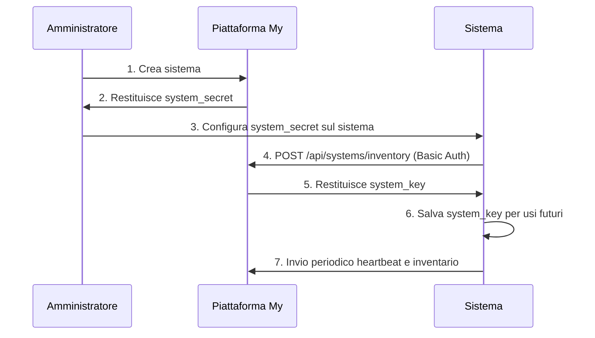

# Registrazione Sistema

La registrazione è il processo mediante il quale un sistema si autentica per la prima volta presso la piattaforma My e ottiene le credenziali permanenti per l'invio di dati.

## Panoramica

La registrazione è un passaggio obbligatorio dopo la creazione del sistema. Senza registrazione, il sistema non può inviare dati di inventario o heartbeat.

## Flusso di Registrazione



## Comprendere le Credenziali

### system_secret (Creato alla Creazione Sistema)

**Formato:** `my_<parte_pubblica>.<parte_secret>`

**Esempio:** `my_a1b2c3d4e5f6g7h8i9j0.k1l2m3n4o5p6q7r8s9t0u1v2w3x4y5z6a7b8c9d0`

**Componenti:**
- **Prefisso**: `my_` (identifica il tipo di token)
- **Parte pubblica**: 20 caratteri esadecimali (per ricerca nel database)
- **Separatore**: `.` (punto)
- **Parte secret**: 40 caratteri esadecimali (hash con SHA256)

**Caratteristiche:**
- Generato automaticamente dalla piattaforma
- Mostrato **una sola volta** al momento della creazione
- Non può essere recuperato successivamente (la rigenerazione ne crea uno nuovo)
- Usato come password nell'autenticazione HTTP Basic durante la prima richiesta
- Viene hashed con SHA256 e memorizzato nel database

### system_key (Ricevuto alla Registrazione)

**Formato:** `NOC-<stringa_casuale>`

**Esempio:** `NOC-F64B-A989-C9E7-45B9-A55D-59EC-6545-40EE`

**Caratteristiche:**
- Generato dalla piattaforma dopo la prima autenticazione riuscita
- Nascosto fino alla registrazione del sistema
- Visibile dopo registrazione riuscita
- Usato come username per HTTP Basic Auth
- Non cambia mai (anche se il secret viene rigenerato)
- Rimane invariato per tutta la vita del sistema

## Processo di Registrazione

### Passo 1: Creazione del Sistema

Un amministratore crea il sistema dalla piattaforma My e riceve il **system_secret**.

### Passo 2: Configurazione sul Sistema

Il system_secret viene configurato sul sistema. Il metodo dipende dal tipo di sistema:

- **NethServer**: Configurazione tramite interfaccia di gestione
- **NethSecurity**: Configurazione tramite interfaccia web

### Passo 3: Prima Richiesta

Il sistema invia la prima richiesta HTTP con autenticazione Basic:

```bash
# Autenticazione con system_secret (prima registrazione)
curl -X POST \
  -u "system_secret:YOUR_SYSTEM_SECRET" \
  -H "Content-Type: application/json" \
  -d '{"inventory": {...}}' \
  https://my.nethesis.it/api/systems/inventory
```

### Passo 4: Validazione della Piattaforma

La piattaforma esegue diversi controlli di sicurezza:

1. **Validazione Formato Token**:
   - Divide su `.` - deve avere esattamente 2 parti
   - La prima parte deve iniziare con `my_`
   - Estrae parti pubblica e secret

2. **Ricerca Database**:
   - Trova il sistema usando la parte pubblica
   - Query indicizzata veloce su `system_secret_public`

3. **Controlli di Sicurezza**:
   - Il sistema non è eliminato
   - Il sistema non è già registrato
   - La parte pubblica corrisponde al valore memorizzato

4. **Verifica Crittografica**:
   - Verifica la parte secret contro l'hash SHA256
   - Confronto a tempo costante (previene attacchi timing)

### Passo 5: Ricezione del system_key

Se l'autenticazione ha successo, la piattaforma restituisce il **system_key**:

```json
{
  "code": 200,
  "message": "inventory received successfully",
  "data": {
    "system_key": "abc123def456"
  }
}
```

### Passo 5: Salvataggio system_key

Il sistema salva il system_key per le comunicazioni future.

### Passo 6: Comunicazioni Successive

Tutte le richieste successive usano il system_key come username:

```bash
# Autenticazione con system_key (richieste successive)
curl -X POST \
  -u "SYSTEM_KEY:YOUR_SYSTEM_SECRET" \
  -H "Content-Type: application/json" \
  -d '{"inventory": {...}}' \
  https://my.nethesis.it/api/systems/inventory
```

## Risposte di Errore

### Formato Token Non Valido (HTTP 400)

```json
{
  "code": 400,
  "message": "formato system secret non valido",
  "data": null
}
```

**Cause:**
- Il token non contiene il separatore `.`
- Il token non inizia con `my_`
- Il token è malformato

**Soluzione:**
- Verifica che il secret sia stato copiato correttamente
- Controlla spazi extra o interruzioni di riga
- Assicurati che sia fornito il token completo

### Credenziali Non Valide (HTTP 401)

```json
{
  "code": 401,
  "message": "system secret non valido",
  "data": null
}
```

**Cause:**
- Parte pubblica non trovata nel database
- Parte secret non corrisponde all'hash
- Secret sbagliato fornito

**Soluzione:**
- Verifica che il secret sia corretto
- Controlla se il secret è stato rigenerato
- Assicurati che il sistema sia stato creato nella piattaforma My

### Sistema Eliminato (HTTP 403)

```json
{
  "code": 403,
  "message": "il sistema è stato eliminato",
  "data": null
}
```

**Cause:**
- Il sistema è stato eliminato in modo soft dall'amministratore
- Sistema contrassegnato come eliminato nel database

**Soluzione:**
- Contatta l'amministratore per ripristinare il sistema
- Crea un nuovo sistema se necessario

### Già Registrato (HTTP 409)

```json
{
  "code": 409,
  "message": "il sistema è già registrato",
  "data": null
}
```

**Cause:**
- Il sistema ha già completato la registrazione
- Il campo `registered_at` non è null

**Soluzione:**
- Il sistema è già registrato, procedi con l'autenticazione
- Usa `system_key` e `system_secret` esistenti per l'autenticazione
- Nessuna azione necessaria a meno che non sia richiesta una ri-registrazione

## Dopo la Registrazione

Una volta registrato, il sistema può:

1. **Inviare heartbeat** periodici per segnalare il proprio stato
2. **Inviare inventario** con i dati di configurazione
3. **Ricevere aggiornamenti** di stato dalla piattaforma

Per maggiori dettagli, consulta la pagina [Inventario e Heartbeat](inventory-heartbeat).

## Ri-Registrazione

In alcuni casi potrebbe essere necessario ri-registrare un sistema:

- Il **system_secret** è stato rigenerato
- Il sistema è stato ripristinato da un backup
- Le credenziali locali sono state perse o corrotte

Per ri-registrare:

1. **Rigenera il secret** dalla pagina di dettaglio del sistema nella piattaforma
2. **Aggiorna la configurazione** sul sistema con il nuovo secret
3. **Riavvia il servizio** di comunicazione sul sistema

:::warning
La rigenerazione del secret invalida le credenziali precedenti. Il sistema non potrà più comunicare con la piattaforma fino al completamento della ri-registrazione.
:::

## Sicurezza

### Protezione delle Credenziali

- Il **system_secret** è hashed con SHA256 nel database
- Le comunicazioni avvengono esclusivamente tramite **HTTPS**
- L'autenticazione **HTTP Basic** è protetta dal canale TLS
- Le credenziali non valide generano un errore 401 senza fornire dettagli sul motivo del fallimento

### Cache delle Credenziali

Per migliorare le prestazioni, le credenziali verificate vengono memorizzate in cache:

- Cache in-process per accesso rapido
- Cache Redis per condivisione tra istanze
- TTL configurabile per invalidazione automatica

## Risoluzione Problemi

### La Registrazione Fallisce con Errore 401

- Verifica che il system_secret sia corretto e non sia scaduto
- Controlla che il system_secret non sia stato rigenerato
- Verifica che il formato dell'autenticazione HTTP Basic sia corretto
- Controlla che la richiesta sia inviata tramite HTTPS

### Il Sistema Non Riceve il system_key

- Verifica che la risposta HTTP sia stata elaborata correttamente
- Controlla i log del sistema per errori di parsing
- Verifica la connettività di rete

### Credenziali Perse

Se le credenziali del sistema sono state perse:

1. Rigenera il secret dalla piattaforma
2. Riconfigura il sistema con il nuovo secret
3. Effettua nuovamente la registrazione

## Argomenti Avanzati

### Script di Registrazione Automatizzata

Per deployment automatizzati, la registrazione può essere scriptata:

```bash
#!/bin/bash

PLATFORM_URL="https://my.nethesis.it"
SYSTEM_SECRET="my_a1b2c3d4e5f6g7h8i9j0.k1l2m3n4o5p6q7r8s9t0u1v2w3x4y5z6a7b8c9d0"

# Registra ed estrai system_key
response=$(curl -s -X POST "$PLATFORM_URL/api/systems/register" \
  -H "Content-Type: application/json" \
  -d "{\"system_secret\": \"$SYSTEM_SECRET\"}")

system_key=$(echo "$response" | jq -r '.data.system_key')

if [ "$system_key" != "null" ] && [ -n "$system_key" ]; then
  echo "Registrazione riuscita!"
  echo "system_key: $system_key"

  # Memorizza credenziali
  echo "MY_SYSTEM_KEY=$system_key" >> /etc/my/config.conf
  echo "MY_SYSTEM_SECRET=$SYSTEM_SECRET" >> /etc/my/config.conf

  # Avvia servizio inventario/heartbeat
  systemctl start my-agent
else
  echo "Registrazione fallita!"
  echo "$response"
  exit 1
fi
```

:::tip
Adatta lo script in base al tipo di sistema e alla struttura dei dati di inventario. Consulta la documentazione del tuo sistema per i dettagli sulla raccolta dei dati di inventario.
:::

### Registrazioni Multiple

**Domanda:** Cosa succede se registro lo stesso sistema più volte?

**Risposta:** Il secondo e successivi tentativi di registrazione falliranno con HTTP 409 (già registrato). Questo è per design per prevenire ri-registrazione accidentale.

### Annullare Registrazione

**Domanda:** Come annullo la registrazione di un sistema?

**Risposta:** Non esiste un'operazione "annulla registrazione". Per resettare:
1. Elimina il sistema (eliminazione soft)
2. Ripristina il sistema
3. Il sistema rimane registrato con lo stesso `system_key`
4. Rigenera secret se necessario

Oppure:
1. Elimina sistema (eliminazione soft)
2. Elimina permanentemente sistema
3. Crea nuovo sistema (nuove credenziali, nuova registrazione)
