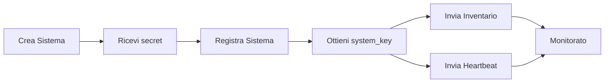

# Benvenuto nella Documentazione My

Documentazione completa per utenti e sviluppatori di **My** - la piattaforma di gestione centralizzata.

## Cos'è My?

My è una piattaforma di gestione completa che fornisce:

- **Autenticazione Centralizzata** usando Logto come Identity Provider
- **Gestione Organizzativa Gerarchica** (Owner, Distributore, Rivenditore, Cliente)
- **Controllo Accessi Basato su Ruoli (RBAC)** con sistema a doppio ruolo
- **Monitoraggio Sistemi** con inventario in tempo reale e tracking heartbeat
- **Gestione Utenti** con email di benvenuto automatiche e funzionalità self-service

## Struttura Documentazione

### 📚 Guida Utente

Guide complete per utenti finali e amministratori:

<div class="grid cards" markdown>

-   :material-login: **Per Iniziare**

    ---

    Impara come accedere, gestire il tuo profilo e comprendere i ruoli utente.

    [:octicons-arrow-right-24: Guida Autenticazione](01-authentication.md)

-   :material-office-building: **Organizzazioni**

    ---

    Crea e gestisci la gerarchia aziendale: Distributori, Rivenditori e Clienti.

    [:octicons-arrow-right-24: Guida Organizzazioni](02-organizations.md)

-   :material-account-group: **Utenti**

    ---

    Crea utenti, assegna ruoli e gestisci i permessi della tua organizzazione.

    [:octicons-arrow-right-24: Guida Utenti](03-users.md)

-   :material-server: **Sistemi**

    ---

    Crea e monitora sistemi, visualizza lo stato e gestisci le credenziali.

    [:octicons-arrow-right-24: Guida Sistemi](04-systems.md)

-   :material-check-circle: **Registrazione**

    ---

    Registra sistemi esterni con la piattaforma My usando i system secret.

    [:octicons-arrow-right-24: Guida Registrazione](05-system-registration.md)

-   :material-chart-line: **Monitoraggio**

    ---

    Configura la raccolta inventario e il monitoraggio heartbeat per i tuoi sistemi.

    [:octicons-arrow-right-24: Inventario & Heartbeat](06-inventory-heartbeat.md)

</div>

### 💻 Documentazione Sviluppatori

Documentazione tecnica per sviluppatori e integratori:

- **[API Backend](https://github.com/NethServer/my/blob/main/backend/README.md)** - Server API REST Go con autenticazione JWT
- **[Servizio Collect](https://github.com/NethServer/my/blob/main/collect/README.md)** - Servizio raccolta inventario e heartbeat
- **[Tool Sync](https://github.com/NethServer/my/blob/main/sync/README.md)** - Tool CLI per sincronizzazione RBAC
- **[Panoramica Progetto](https://github.com/NethServer/my/blob/main/README.md)** - Documentazione completa del progetto e architettura

## Guida Rapida

### 🧑 Per Utenti Finali

1. **[Accedi](01-authentication.md)** con le tue credenziali
2. **[Crea organizzazioni](02-organizations.md)** in base alla tua gerarchia aziendale
3. **[Aggiungi utenti](03-users.md)** e assegna i ruoli appropriati
4. **[Crea sistemi](04-systems.md)** per i tuoi clienti
5. **[Registra sistemi](05-system-registration.md)** per abilitare il monitoraggio

### 🧑‍💻 Per Sviluppatori

1. Clona il repository
2. Leggi la [Documentazione del progetto](https://github.com/NethServer/my/blob/main/README.md)
3. Configura il tuo ambiente di sviluppo
4. Segui la [guida configurazione RBAC](https://github.com/NethServer/my/blob/main/sync/README.md)

## Funzionalità Principali

### 🔐 Sicurezza Prima di Tutto

- **Argon2id** hashing dei secret (memory-hard, resistente GPU)
- **Token Split Pattern** per credenziali di sistema
- Autenticazione **basata su JWT** con blacklist token
- **RBAC** con permessi gerarchici

### 🏢 Gerarchia Aziendale

```
Owner (Nethesis)
    ↓
Distributori
    ↓
Rivenditori
    ↓
Clienti
```

Ogni livello gestisce solo le organizzazioni sottostanti.

### 👥 Sistema a Doppio Ruolo

**Ruoli Organizzazione** (gerarchia aziendale):
- Owner, Distributore, Rivenditore, Cliente

**Ruoli Utente** (capacità tecniche):
- Admin, Support, e altri

Permessi effettivi = Ruolo Organizzazione + Ruolo Utente

### 📊 Monitoraggio in Tempo Reale

- **Tracking heartbeat** ogni 5 minuti
- **Raccolta inventario** ogni 6 ore
- **Rilevamento automatico modifiche** con analisi diff
- **Indicatori stato**: Attivo 🟢 / Inattivo 🟡 / Sconosciuto ⚪ / Eliminato 🔴

### 🔄 Ciclo di Vita Sistema



## Ottenere Aiuto

### Per Utenti

- Esplora le sezioni della [Guida Utente](01-authentication.md)
- Controlla le sezioni troubleshooting in ogni guida
- Contatta il tuo amministratore di sistema

### Per Sviluppatori

- Leggi i README specifici dei componenti
- Consulta la documentazione API
- Rivedi la documentazione architettura in [DESIGN.md](https://github.com/NethServer/my/blob/main/DESIGN.md)
- Apri un issue su [GitHub](https://github.com/NethServer/my/issues)

## Stack Tecnologico

- **Backend**: Go 1.24+ con framework Gin
- **Database**: PostgreSQL con migrazioni
- **Cache**: Redis per caching ad alte prestazioni
- **Identity**: Logto per autenticazione e RBAC
- **Frontend**: Vue.js 3 (vedi repository separato)

## Informazioni Versione

Versione corrente: **0.3.0** (Pre-produzione)

Questa documentazione viene aggiornata continuamente. Ultimo aggiornamento: 2025-11-07

---

<div class="grid cards" markdown>

-   :material-rocket-launch: **Pronto per Iniziare?**

    ---

    Inizia con la guida autenticazione per accedere ed esplorare My.

    [:octicons-arrow-right-24: Inizia](01-authentication.md)

-   :material-github: **Contribuisci**

    ---

    My è open source. Contribuisci su GitHub!

    [:octicons-arrow-right-24: Repository GitHub](https://github.com/NethServer/my)

</div>
